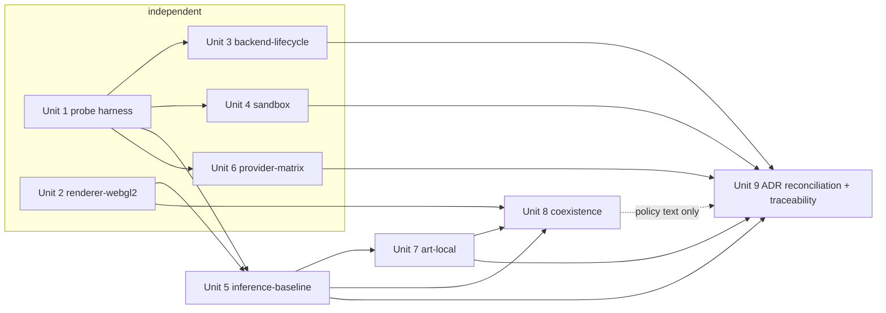

# feat: M0 feasibility probes

## Overview

Run six measured probes on the M1 Pro 16 GB baseline — packaged WebGL2 rendering, sidecar lifecycle, local inference, local art, generated-code sandbox, hosted providers — and use their evidence to move ADRs 0003–0007 from proposed to accepted or revised, closing M0 of the roadmap.

## Problem Frame

The product package fixes the stack (Tauri, Three.js, Three Flatland, Bun) and the offline-first boundary, but delegates the backend, models, image runtime, sandbox mechanism, and platform minimums to probes (D23, `docs/product/open-decisions.md`). ADRs 0001–0002 are accepted; 0003–0007 are proposals gated on M0 evidence. The one completed probe (`tools/probes/webgpu-wkwebview`) already changed a decision (D25). M1 cannot start until the service shape, sandbox, and model profile are grounded in measurements rather than documentation review.

Two constraints shape every unit: the 16 GB unified memory pool is shared by the renderer, the LLM, and the image model; and nothing may introduce a purchase, subscription, or hosted dependency (D21, AGENTS.md).

## Requirements Trace

- R1. Packaged Tauri app renders a Three Flatland scene on WebGL2 on macOS 15 with measured frame time and input latency (P02, P05, ADR-0002).
- R2. Bun sidecar with `bun:sqlite` survives window close, stops on explicit quit, recovers from crash, does not orphan on force-quit, and does not double-advance time across sleep/resume (P03, W03, O03, ADR-0003).
- R3. Local inference profile: candidate models measured for schema validity, latency, throughput, and memory with the renderer running; a scheduling estimate for 7 gods + 20 inhabitants (P04, P06, ADR-0005).
- R4. Local image generation measured for seconds/image, peak memory, cancellation, and coexistence with inference and rendering (U06, U07, ADR-0007).
- R5. Generated-code runtime terminates escape attempts, infinite loops, deep recursion, and allocation bombs within measured limits with the host process intact (U04, U05, ADR-0004).
- R6. Hosted provider adapters exercised with a configured fallback sequence ending in routine-only mode; offline mode makes no network requests (P07, D22, ADR-0005).
- R7. Every probe leaves a README under `tools/probes/<name>/` in the established format, and traceability rows for the touched requirements gain evidence links (P08).

## Scope Boundaries

- No product code lands in `apps/client`, `apps/simulation`, or `packages/*` beyond what a probe needs to be runnable; the renderer probe is its own app.
- No Windows or Linux execution; those remain conditional (P05) with the probe design portable for later runs.
- No Langfuse/OTel export probe and no save/replay probe — `docs/product/architecture-options.md` lists them in its probe table, but `docs/product/mvp-roadmap.md` places telemetry and persistence in M1 with product code and `docs/product/open-decisions.md` assigns them to M1/M6; the roadmap governs.
- No paid code signing or notarization; ad-hoc signing only.
- No OpenAI or Anthropic live calls (no keys); contract tests only.
- No population tuning beyond the estimate; the live population experiment is M2.

### Deferred to Separate Tasks

- Signed-app WebGPU re-check on macOS 26 and Windows WebView2 WebGPU: when hardware is available.
- Fixed-memory QuickJS WASM build if the stock build's memory limit proves soft: M1 sandbox hardening.
- Telemetry export and save/replay probes: M1/M6 per roadmap.

## Context & Research

### Relevant Code and Patterns

- `tools/probes/webgpu-wkwebview/README.md` — the probe report format: question, how to run, caveat, environment, raw results, findings, bottom line.
- `tools/probes/README.md` — index; each probe is a subdirectory. Nested probe dirs are not workspace packages; runnable TypeScript needs its own `package.json` under `tools/probes/<name>/` to join `bun run check`, or lives in a dedicated app.
- `apps/desktop/src-tauri/tauri.conf.json` — no `bundle.externalBin`, capabilities are `core:default` only, CSP is tight. The lifecycle probe extends this shell; the renderer probe does not.
- `apps/simulation/src/index.ts` — loopback `Bun.serve` health skeleton with SIGTERM/SIGINT handling; the sidecar probe builds on it.
- `apps/client/vite.config.ts` — port 1420/1421, `VITE_` env prefix, `src-tauri` ignored; template for the probe app's Vite config.
- `docs/product/acceptance.md` — provisional targets (30 FPS at 1280×720, 100 ms input p95, 10 s first reply / 30 s completion p95).
- `docs/product/defaults.md` — one-hour catch-up cap, 60 s checkpoint.

### Institutional Learnings

- `docs/solutions/2026-09-26-wkwebview-webgpu-unavailable-macos-15.md` — WebGL2 is the baseline, not a temporary fallback.
- Mothership `docs/solutions/documentation-gaps/mothership-phase1-tracer-deviations-2026-07-04.md` — re-verify live server and Tauri lifecycle behavior; research snapshots drift.
- Mothership `docs/solutions/best-practices/pty-portable-pty-xterm6-decision-2026-07-04.md` — keep a fragile backend behind one narrow seam so swaps stay reversible.
- Mothership `docs/solutions/integration-issues/tauri-dragdrop-swallows-dockview-dnd-2026-07-04.md` — Tauri window config can silently intercept DOM input; validate input in the packaged app.

### External References

- `docs/research/stack-2026-09-26.md`, `docs/research/inference-2026-09-26.md` — prior research; not repeated here.
- three-flatland alpha.10 exports (README, tjw.dev): `Sprite2D`, `AnimatedSprite2D`, `SpriteGroup`, `TileMap2D`, `SpriteSheetLoader`, `PixelPerfectCamera`, `createMaterialEffect`, `sortLayer` + `zIndex`, React bindings, `@three-flatland/nodes`. Lighting/shadows "in development"; particles and hit testing unverified as stable exports.
- three.js `WebGPURenderer({ forceWebGL: true })` forces the WebGL2 backend; automatic fallback otherwise.
- Tauri 2.12: `bundle.externalBin` with `-aarch64-apple-darwin` suffix; `app.shell().sidecar()` from Rust; `RunEvent::ExitRequested`/`Exit`; `tauri-plugin-single-instance` must register first.
- quickjs-emscripten 0.32: `setMemoryLimit`, `setMaxStackSize`, `setInterruptHandler` + `shouldInterruptAfterDeadline`, `removeModuleLoader()`. Issues #255/#219: memory limit is soft on the growth-enabled prebuilt WASM; interrupt may not fire inside giant allocation/stringify paths.
- wasmoon 1.16: `openStandardLibs`, `injectObjects`, `enableProxy`, `functionTimeout`, `traceAllocations`, `lua_sethook` count mask.
- OpenCode Zen: free models include Big Pickle, MiMo-V2.5 Free, Ling 3.0 Flash Fin Free, Nemotron 3 Ultra Free, Nemotron 3.5 Lightning Free, Muse Spark 1.2/1.3 Contributor Free; endpoints `https://opencode.ai/zen/v1/{responses,chat/completions,messages}`; Go at `https://opencode.ai/zen/go/v1/...` ($10/mo, $12 per 5 h, $30 weekly, $60 monthly). No per-model structured-output/tool-calling matrix is published. `auth.json` records are `{type:"api", key}` or `{type:"oauth", access, refresh, expires}`; the exact provider key string is unverified.

## Prior-Art Survey

```json
{
  "schema_version": 2,
  "verdict": "extend",
  "scope": "tools/probes and tools/scenarios, with wiring checks in apps/client and apps/desktop",
  "freshness": {
    "vcs_reference": "main@d9ab9fc"
  },
  "budget": {
    "max_search_passes": 3,
    "max_candidate_inspections": 10,
    "exhausted": false
  },
  "candidates": [
    {
      "path_or_symbol": "tools/probes/README.md",
      "description": "Probe directory contract: one probe per subdirectory, README records method and results.",
      "disposition": "reuse"
    },
    {
      "path_or_symbol": "tools/probes/webgpu-wkwebview/README.md",
      "description": "Completed renderer feasibility probe report with question, run steps, caveat, environment, results, findings, bottom line.",
      "disposition": "reuse"
    },
    {
      "path_or_symbol": "tools/probes/src/index.ts",
      "description": "Workspace anchor package for probes; exports placeholder status only.",
      "disposition": "insufficient",
      "insufficiency_reason": "Package sentinel only; provides no harness for running or packaging probe scenes."
    },
    {
      "path_or_symbol": "tools/scenarios/README.md",
      "description": "Acceptance fixtures and manual comparison tools for causal scenarios.",
      "disposition": "extend"
    },
    {
      "path_or_symbol": "tools/scenarios/src/index.ts",
      "description": "Placeholder anchor for the first headless scenario fixture.",
      "disposition": "insufficient",
      "insufficiency_reason": "Stub; no reusable scenario fixture or benchmark runner yet."
    }
  ]
}
```

## Key Technical Decisions

- **Renderer probe is a separate app (`apps/probe-renderer`), not a feature flag in `apps/desktop`**: the question is WKWebView-in-a-bundle, so a Tauri app is required; a flag in the product shell would leave probe-only code in the product surface. The probe app is workspace-visible and deletable after M0.
- **Ad-hoc signing is the M0 packaging path, not a release posture**: `codesign -s -` plus `xattr -cr` on the built `.app`. Developer ID + notarization loses for M0 because it adds provisioning cost without changing the lifecycle or webview evidence; it is M7 work (and a purchase, which D21 forbids now). Each README states the bundle was ad-hoc signed and carries the line "M0 probe only — never release guidance"; ADR-0003 records that ad-hoc signing is disallowed outside M0.
- **Sidecar spawned and supervised from Rust, not JS**: the JS path loses because it widens the capability surface (`shell:allow-spawn`) and splits ownership of the child handle from the shutdown path. The shell is the process authority: it owns the handle, restarts on unexpected exit, and kills on `RunEvent::Exit`.
- **Orphan guard is stdin-EOF plus parent-PID poll plus an ownership lock file**: EOF alone loses to force-quit and ancestor crashes that leave the pipe held; PID polling alone loses to PID reuse and misses fast exits. The sidecar also writes a lock file in the app data dir holding its own PID, the parent PID, and the launch token: on start, a lock whose PID is dead is reclaimed; a running sidecar whose recorded parent is dead self-terminates. This is the launchd-free stale-lock recovery; a launchd agent is only justified if the service must outlive the app, which ADR-0003 does not require.
- **Duplicate-start guard is the single-instance plugin first, then a SQLite-side lock**: single-instance alone loses to a dead parent with a stale orphan holding the database; the lock alone loses to launch races before the database opens. Ordering is fixed: plugin first, then interpret a held lock as recovery state, never as the primary exclusivity mechanism.
- **Heavy-work serialization: the global mutex is the hypothesis Unit 8 tests, not the conclusion**: candidates are (a) global mutex — at most one of {LLM generation, image generation} at a time; (b) admission-controlled queue with a measured memory budget; (c) unconstrained. The renderer is never blocked under any policy. Unit 8 measures all three on 16 GB; whichever policy keeps the renderer at target with no sustained swap and the best combined throughput is the one M1 inherits.
- **Sandbox candidate order: QuickJS first, Lua second**: Lua-first loses because wasmoon's hard-limit story is weaker (hooks, no cap) and would need extra host metering to prove termination under allocation pressure. QuickJS wins only as the bounded-execution mechanism; the world validator is the real boundary either way, so the probe measures termination, not "unhackability". The behavior language stays a JS subset unless the Lua arm wins on a measured criterion.
- **Hosted provider order for probes: Zen free → Go → local — probe sequencing, not product preference**: Zen free is always available; Go is usage-limited ($12/5 h), so live calls are capped. The product default remains local-first with hosted as configured fallback. Key is read from `~/.local/share/opencode/auth.json` at runtime. OpenAI/Anthropic get contract tests against recorded fixtures only.
- **Offline-mode proof is a packet capture, not a code review or a stubbed HTTP layer**: those weaker forms don't prove the process is silent on the wire. Run the matrix under `tcpdump -i any` with hosted providers configured but offline mode on; zero non-loopback packets and zero provider DNS lookups is the evidence.
- **Model staging is a prerequisite, not part of the benchmark**: downloads happen before timing and are recorded (identifier, quantization, size); a download during a run contaminates latency and memory and invalidates that run.
- **Draw Things is the macOS validation arm; stable-diffusion.cpp is the portable arm — not interchangeable**: Draw Things is installed with SD 1.5, SDXL step-distilled LoRAs, and Qwen Image 2.1 support but is macOS-only; sd.cpp proves the Linux/Windows path but not the Draw Things behavior. Both drive through HTTP from the service; each run records which path it used.
- **Asset placeholder is a probe stub and an ADR-0007 recommendation, not a fixed contract**: the probe returns a stable URI to a procedurally composed placeholder immediately and hot-swaps it when the image lands, because waiting on generation would block the renderer. ADR-0007 records this shape as the recommended asset job contract; M1/M4 define the real contract in `packages/contracts`.
- **Probe TypeScript is workspace-visible**: each runnable probe dir gets its own `package.json` (`@panthea/tools-probes-<name>`, private, matching the `@panthea/tools-*` family) so `bun run check` covers it; the root glob gains `tools/probes/*` alongside the existing `tools/*` (no conflict — `tools/probes` stays a member). Shared helpers and the probe action schema live in `tools/probes/shared` (`@panthea/tools-probes-shared`), a leaf package that never imports a probe; the schema is promoted to `packages/contracts` only when M1 defines the product command/event contracts. Keeping probes outside the workspace loses because it hides breakage from the main gate. Only generated outputs are gitignored, never probe source.

## Open Questions

### Resolved During Planning

- Should probes reuse `apps/client`? No — separate probe app (see KTDs).
- Which hosted credentials exist? Only OpenCode (Zen/Go) via `auth.json`; OpenAI/Anthropic are contract-test-only for M0.
- Is Draw Things in scope? Yes, installed and updated (26.0924.0, Qwen Image 2.1).
- Does WebGL2 count for Linux? Yes (D25, ADR-0002); the probe design must be portable, execution is deferred.

### Deferred to Implementation

- The exact Zen `auth.json` provider key and which free models honor JSON schema / tool calls: discovered by the provider probe's first live call.
- Whether `renderer.backend` exposes a stable "is WebGL" property or the probe infers it from `navigator.gpu` and a capability query: settle when the scene first boots.
- Whether Draw Things keeps serving while backgrounded, and the exact Qwen Image 2.1 quantizations it ships: verify on the installed build.
- Whether quickjs-emscripten's soft memory limit is acceptable for M1 or a fixed-memory WASM build is required: decided by the allocation-bomb result.
- Whether `bun build --compile` output containing `bun:sqlite` runs from a clean bundle, and whether the binary embeds build-host paths or env strings: the lifecycle probe's first packaged run and its artifact scan answer both.

## Output Structure

Illustrative shape, not the exhaustive inventory; each unit's Files list is authoritative.

    apps/probe-renderer/              Tauri + Vite scene app (mirrors apps/desktop + apps/client shape; standalone Cargo crate, own Cargo.lock, no root Cargo workspace)
      package.json  index.html  vite.config.ts  src/{main.tsx,Scene.tsx,metrics.ts}
      src-tauri/{Cargo.toml,tauri.conf.json,capabilities/default.json,src/{main.rs,lib.rs}}
    tools/probes/
      renderer-webgl2/README.md       evidence only; points at apps/probe-renderer
      backend-lifecycle/{README.md,package.json,src/*.ts,scripts/*.sh}
      shared/{package.json,src/{env.ts,report.ts,timing.ts,schema.ts}}
      inference-baseline/{README.md,package.json,src/{bench.ts,servers.ts,fixtures/*.json}}
      art-local/{README.md,package.json,src/{drawthings.ts,sdcpp.ts,bench.ts}}
      sandbox/{README.md,package.json,src/{quickjs.ts,lua.ts,fixtures/*.{js,lua}},src/*.test.ts}
      provider-matrix/{README.md,package.json,src/{auth.ts,providers.ts,repair.ts,fallback.ts,offline.ts},src/*.test.ts}
      coexistence/README.md           cross-probe run evidence
    docs/decisions/000{3..7}-*.md     status flips with evidence links
    docs/product/traceability.md      evidence links for P02–P07, W03, O03, U04–U07

## High-Level Technical Design

> *This illustrates the intended approach and is directional guidance for review, not implementation specification. The implementing agent should treat it as context, not code to reproduce.*



Each evidence lane (Units 3–7) flips its own ADR in its own PR. Unit 8 informs the shared memory policy wording in 0003/0005/0007; it does not gate the flips. Unit 9 reconciles cross-ADR wording, the index, open-decisions, and traceability.

## Implementation Units

- [ ] **Unit 1: Probe harness and workspace wiring**

**Goal:** Make runnable probe code a first-class part of the workspace and share the small pieces every probe needs.

**Requirements:** R7

**Dependencies:** None

**Files:**
- Modify: `package.json` (add `tools/probes/*` to `workspaces`, keeping `apps/*`, `packages/*`, `tools/*`), `tools/probes/README.md`
- Create: `tools/probes/shared/{package.json,src/{env.ts,report.ts,timing.ts,schema.ts}}`, `tools/probes/shared/src/{env.test.ts,report.test.ts,timing.test.ts,schema.test.ts}`

**Approach:**
- `env.ts` captures the environment block used by every README (hardware, OS, Bun, Tauri, model IDs) from the machine and pinned manifests.
- `report.ts` emits the README results section from a JSON result object so numbers are never hand-copied, and scrubs usernames, absolute home paths, hostnames, and serials from every artifact.
- `timing.ts` provides p50/p95 helpers and a wall-clock/`process.cpuUsage`/RSS sampler.
- `schema.ts` is the action-proposal schema shared by Units 5 and 6: a discriminated union of `move|say|trade|strike|idle` with typed fields, parse-don't-validate.

**Patterns to follow:** `tools/probes/webgpu-wkwebview/README.md` section order; `@panthea/*` naming; `bun:test`.

**Test scenarios:**
- Happy path: a result object with 100 samples renders a table with p50/p95 that match a hand-computed value.
- Edge case: empty sample set renders "no samples" rather than NaN; odd/even counts and unsorted input give the same percentiles.
- Happy path: `report.ts` emits sections in the established README order.
- Error path: `env.ts` output never contains values from `OPENCODE_*`/`*_KEY`/`*_TOKEN` env names; partial environment data renders "unknown" fields, not a throw.
- Error path: `report.ts` replaces a home path and the current username in a sample artifact with placeholders.
- Happy path: each `schema.ts` action variant parses; malformed field fails with a path; unknown action kind is rejected, not coerced.

**Verification:** `bun run check` includes the new package; README index lists all planned probe dirs.

- [ ] **Unit 2: renderer-webgl2 — packaged Three Flatland scene**

**Goal:** Prove D25 in a packaged bundle: Flatland features render on the WebGL2 backend at target frame rate with measured input latency, and record `navigator.gpu` inside an ad-hoc-signed `.app`.

**Requirements:** R1, R7

**Dependencies:** None (Unit 1 optional for report formatting)

**Files:**
- Create: `apps/probe-renderer/**` (see Output Structure), `tools/probes/renderer-webgl2/README.md`, `tools/probes/renderer-webgl2/sign-and-run.sh`
- Modify: `docs/product/traceability.md` (P02, P05 evidence)

**Approach:**
- Scene: 64×64 `TileMap2D` town floor, 200 `Sprite2D` with `sortLayer`/`zIndex` isometric ordering, 30 `AnimatedSprite2D`, one `createMaterialEffect` lightning/fire effect on `@three-flatland/nodes`, `PixelPerfectCamera`, click-to-select via manual raycast if no stable hit-test export exists.
- Boot with `WebGPURenderer` and let it fall back; log backend, `navigator.gpu`, `navigator.userAgent`, WebGL renderer string. Add a `?forceWebGL=1` query for an explicit WebGL2 run.
- Metrics overlay: frame time p50/p95, click-to-visible-response latency (timestamp on `pointerdown` → first frame the selection highlight is drawn), and a `webglcontextlost`/`restored` counter; dump JSON to stdout via a Tauri command so the README section is generated. Targets (33 ms frame p95, 100 ms input p95) are the provisional numbers from `docs/product/acceptance.md`; the README reports measured versus target, not pass/fail.
- Falsification criterion for D25: if any of tilemap, sprite batching, animated sprites, or layer ordering fails to render on WebGL2, or steady-state frame p95 exceeds twice the provisional target, the README states that WebGL2-on-Flatland does not meet the baseline and ADR-0002 must name the alternative (raise the macOS minimum to 26, or a non-Flatland 2D path) before M1. Effect-level misses only constrain effects.
- Artifact redaction: every README, JSON dump, and screenshot is scrubbed of usernames, absolute home paths, hostnames, and serials before commit; `report.ts` (Unit 1) applies the rule and a test asserts it.
- Exercise: steady state 60 s; effect burst 30 s; window resize/fullscreen; display sleep 60 s then wake (context loss).
- Build with `tauri build`, then `codesign -s -` and `xattr -cr` the bundle; run from `/Applications`-style path, not the build dir.

**Patterns to follow:** `apps/client/vite.config.ts`, `apps/desktop/src-tauri/*` (thin `lib.rs`, tight CSP, `core:default`).

**Test scenarios:**
- Happy path: backend reports WebGL2 on macOS 15; all five feature groups render; frame time p95 ≤ 33 ms at 1280×720 in steady state.
- Edge case: effect burst frame time recorded separately; if p95 > 33 ms the README says so with the number.
- Error path: a TSL node that fails GLSL transpilation is caught and reported per-effect rather than crashing the scene.
- Integration: context loss on display sleep triggers rebuild; sprite count and animation state match pre-loss.
- Integration: `navigator.gpu` recorded from inside the signed `.app`, compared with the unsigned-script result.

**Verification:** README contains environment, raw metrics JSON, screenshots of each feature group, the `navigator.gpu` line, and a bottom line stating whether the P02 acceptance evidence is met on WebGL2.

- [ ] **Unit 3: backend-lifecycle — Bun sidecar under Tauri**

**Goal:** Prove the service shape in ADR-0003: compiled Bun sidecar with `bun:sqlite`, supervised by the shell, tray mode, clean quit, crash restart, no orphan, no double time advancement.

**Requirements:** R2, R7

**Dependencies:** Unit 1

**Files:**
- Create: `tools/probes/backend-lifecycle/{package.json,README.md,src/{sidecar.ts,clock.ts,clock.test.ts},scripts/{build-sidecar.sh,lifecycle.sh}}`
- Modify: `apps/desktop/src-tauri/{Cargo.toml,tauri.conf.json,capabilities/default.json,src/lib.rs}`, `apps/desktop/package.json`, `docs/product/traceability.md` (P03, W03, O03 evidence)

**Approach:**
- `sidecar.ts` extends the simulation skeleton: OS-assigned port printed on stdout, a per-launch auth token delivered over stdin (never argv or env) and required on every request, `bun:sqlite` WAL database in the app data dir (directory 0700, files 0600, asserted by the probe) with an `events` table and a `clock` table holding a last-applied wall-time cursor, a 1 Hz tick that commits an event, stdin-EOF exit, parent-PID poll, ownership lock file, SIGTERM flush. Trust boundary: only the shell is an authorized client; localhost is not a security boundary, so the token is the authorization.
- `clock.ts`: only what the ADR needs — a persisted cursor and a guard that an elapsed interval is applied at most once across sleep/resume and crash/restart. The one-hour cap, chunked catch-up, and `approximate` flag are M1 time/storage work (`defaults.md`), not probe scope.
- Shell: `tauri-plugin-shell` (Rust side only), `tauri-plugin-single-instance` registered first, tray with Show/Quit, `ExitRequested` prevented on window close, sidecar killed in `Exit`; supervisor restarts the child with backoff on unexpected exit. `externalBin` names the compiled binary with the target triple.
- `lifecycle.sh` drives the packaged app through: start → close window → verify tick continues → Quit → verify exit; start → `kill -9` sidecar → verify restart and event continuity; start → `kill -9` app → verify sidecar exits within N s and its lock is reclaimable; two launches → second is refused; stale lock with dead PID → next start reclaims it; `pmset sleepnow` 2 min → resume → verify the interval is applied once and no duplicate tick IDs.
- Record RSS of shell and sidecar at each state; run `PRAGMA integrity_check` after every kill; scan the compiled sidecar binary for build-host paths and env strings and fail the probe if any appear.

**Patterns to follow:** `apps/simulation/src/index.ts`; Mothership's narrow-seam backend pattern.

**Test scenarios (clock.test.ts, bun:test):**
- Happy path: an elapsed interval is applied once and the cursor advances to its end.
- Edge case: cursor restored from DB after a simulated crash mid-apply advances only the unapplied remainder — never twice.
- Error path: negative wall delta (clock set back) advances zero and logs.

**Test scenarios (lifecycle.sh, recorded in README):**
- Integration: each transition above with process-tree snapshots, tick continuity, integrity result, and RSS.
- Error path: compiled sidecar with `bun:sqlite` runs from the bundle on a shell with no Bun on PATH.
- Error path: a request without the launch token is rejected; the database directory and files carry the asserted modes.

**Verification:** README records every transition's evidence; ADR-0003 has enough to flip or to name the alternative (OS-managed agent).

- [ ] **Unit 4: sandbox — QuickJS and Lua under adversarial fixtures**

**Goal:** Measure termination behavior and host survival for the two runtime candidates and settle the ADR-0004 mechanism.

**Requirements:** R5, R7

**Dependencies:** Unit 1

**Files:**
- Create: `tools/probes/sandbox/{package.json,README.md,src/{host.ts,quickjs.ts,lua.ts,api.ts,fixtures/**,quickjs.test.ts,lua.test.ts}}`
- Modify: `docs/product/traceability.md` (U04, U05 evidence)

**Approach:**
- `api.ts`: a tiny validated world API (`move`, `say`, `spend`) with parse-don't-validate inputs and an invocation budget; the only host bridge exposed.
- `host.ts`: runs every fixture in a `Bun.spawn` subprocess (a Worker is in-process and shares the heap, so it cannot give a separate RSS boundary or survive a memory bomb) so the measured RSS and termination belong to the isolated runtime; the main probe process only supervises and collects. The outer wall-clock timeout + kill is the control path, not the boundary under test.
- `quickjs.ts`: fresh runtime per execution, `setMemoryLimit`, `setMaxStackSize`, `setInterruptHandler(shouldInterruptAfterDeadline)`, `removeModuleLoader()`, no globals beyond the API.
- `lua.ts`: `LuaFactory` with `openStandardLibs: false`, `injectObjects: false`, `enableProxy: false`, `functionTimeout`, `lua_sethook` count mask; same API surface.
- Fixtures (both languages): `require`/`import`/`io`/`os`/`process`/`fetch`/`Bun` reach; host `globalThis` via a leaked host object; `Function`/`eval` constructors; `Symbol.for` cross-realm probing; Proxy traps on API arguments; getter side effects and `toString`/`valueOf` coercion on validated inputs; timers; `WebAssembly` instantiation from inside the guest; `Atomics.wait`; infinite loop; deep recursion; allocation bomb (array growth, string doubling/`repeat`, giant `JSON.stringify` — the paths where the interrupt may not fire); prototype pollution / metatable on API objects; unresolved promise / pending microtask; API called with malformed args, stale entity ID, over-budget calls; partial failure after two committed API calls.
- Fixtures are grouped into seven categories for reporting — external capability access, loop/recursion, allocation, async hang, malformed API input, partial-failure rollback, next-run health — so the README matrix stays readable; individual fixtures are rows within a category.
- Record per fixture: outcome (blocked / terminated / escaped), time to termination, peak isolated RSS, whether the supervisor and the next execution are healthy.

**Execution note:** Write the fixture matrix and expected outcomes first; each runtime arm is implemented to make the matrix pass or to record a measured failure.

**Patterns to follow:** `bun:test`; `docs/product/simulation-direction.md` "Generated behavior".

**Test scenarios:**
- Happy path: a valid behavior calls `move` then `say`; both land in the API log; execution time and RSS recorded.
- Error path: every escape fixture yields "blocked" with no side effect on the host.
- Error path: infinite loop terminates within the deadline (record ms); deep recursion hits the stack limit; allocation bomb terminates or — if the stock WASM grows past the limit — the Worker/subprocess is killed by the supervisor and the README records isolated RSS, time to kill, and the failure honestly, separate from supervisor RSS.
- Error path: each escape-primitive fixture (Function/eval, Proxy, coercion, WebAssembly, Atomics.wait, timers) is blocked or has no host effect; any "escaped" result is a P0 finding in the README.
- Edge case: after a terminated fixture, the next valid behavior runs normally in a fresh runtime.
- Integration: partial-failure fixture leaves the API log with exactly the committed calls and a rolled-back marker.

**Verification:** README has the full fixture matrix for both arms with numbers; ADR-0004 can name the mechanism and its measured limits, and whether a fixed-memory WASM build is required.

- [ ] **Unit 5: inference-baseline — local model profile**

**Goal:** Measure candidate local models on a fixed action-schema eval with the renderer running, and estimate the population schedule.

**Requirements:** R3, R7

**Dependencies:** Unit 1, Unit 2 (renderer running during timing)

**Files:**
- Create: `tools/probes/inference-baseline/{package.json,README.md,src/{bench.ts,servers.ts,fixtures/{prompts.json,expected.json}},src/parity.test.ts}`
- Modify: `docs/product/traceability.md` (P04, P06 evidence)

**Approach:**
- Servers: Ollama (installed, 0.34.4) and `llama-server` (pinned release artifact); both through their OpenAI-compatible endpoints with JSON-schema constrained output.
- Candidates, pre-staged and recorded: Qwen3.5-4B Q4, Gemma 4 E4B, Ministral 3 8B Instruct, Phi-4-mini 3.8B; Llama 3.2 3B as baseline.
- Eval: 40 prompts (dialogue turn + action proposal against the shared `schema.ts`) at 1K and 4K context; measure schema validity rate, TTFT, completion latency p50/p95, tok/s, server RSS, with the renderer probe scene running in the background.
- Concurrency: `parallel=1` vs `parallel=2` on the best model; note KV-cache memory growth.
- Schedule estimate: given measured completion latency, compute reasoning turns/minute and the per-character cadence for 7 gods + 20 inhabitants under bounded queues; state the starvation threshold.
- Outage: stop the server mid-run; verify the bench reports a clean timeout and continues with the next server.

**Patterns to follow:** `docs/product/acceptance.md` model feedback targets.

**Test scenarios (parity.test.ts):**
- Integration: the same recorded model output parses identically through the local (Ollama/llama.cpp) response path and the hosted adapter path — the schema is shared for this reason.

**Test scenarios (bench, recorded):**
- Happy path: per-model table with validity rate and latencies at both contexts.
- Error path: server down → recorded timeout, no crash.
- Integration: renderer frame-time p95 during inference recorded alongside.

**Verification:** README names a baseline model profile (model, quantization, context, parallelism) that meets or measurably misses the 10 s / 30 s p95 targets, and the population estimate; ADR-0005 local section can flip.

- [ ] **Unit 6: provider-matrix — hosted adapters, fallback, offline proof**

**Goal:** Exercise OpenCode Zen/Go live, OpenAI/Anthropic by contract, the configured fallback chain to routine-only, and prove offline mode is silent on the wire.

**Requirements:** R6, R7

**Dependencies:** Unit 1

**Files:**
- Create: `tools/probes/provider-matrix/{package.json,README.md,src/{auth.ts,providers.ts,repair.ts,fallback.ts,offline.ts,fixtures/{openai,anthropic}/*.json},src/{auth.test.ts,fallback.test.ts,providers.test.ts,repair.test.ts}}`
- Modify: `.gitignore` (probe output dir), `docs/product/traceability.md` (P07 evidence)

**Approach:**
- `auth.ts`: read `~/.local/share/opencode/auth.json`, accept `api` and `oauth` record shapes, warn if file mode is not 0600. Secret containment: the record stays in memory only; never forwarded into child-process env; never included in AI SDK errors, telemetry, or request/response dumps; provider exceptions are redacted before any README or raw-output write; probe artifacts never capture headers, env snapshots, or auth blobs. A test greps every artifact for the key prefix.
- `providers.ts`: Vercel AI SDK 7 adapters — `@ai-sdk/openai` for `/responses`, `@ai-sdk/openai-compatible` for `/chat/completions`, `@ai-sdk/anthropic` for `/messages` — parameterized by base URL so Zen, Go, Ollama, and recorded-fixture servers share one path.
- Live matrix, capped at ~20 requests per model: two Zen free models (one `/responses`, one `/chat/completions`) and one Go model; test structured output via the shared `schema.ts` and one tool call; record latency, 429s, and whether schema is honored natively or needs a repair pass. `repair.ts` is the single repair path (extract JSON, re-validate) used by every adapter so parity is measured, not assumed.
- `fallback.ts`: configured sequence Zen → Go → local Ollama → routine-only; simulate failures by pointing at a dead port and a 429-returning stub; assert bounded retries and a degraded-status event.
- `offline.ts`: with all hosted providers configured and offline mode on, run 20 requests under `tcpdump -i any` (all interfaces incl. loopback, IPv6, utun/awdl) plus a DNS-query log from mDNSResponder; any non-loopback packet attributable to the process, or any DNS lookup for a provider host, is a failure. Loopback traffic to the local Ollama port is expected and confirmed. Capture needs `sudo`; the README run instructions document the one elevated step and the probe refuses to claim an offline result without it (the weaker `nettop`/`lsof -i` sampling is recorded as advisory only).
- OpenAI/Anthropic: adapters instantiated against fixture servers replaying recorded responses; no keys.

**Patterns to follow:** ADR-0005; `docs/product/technical-constraints.md` "Model and image adapters".

**Test scenarios:**
- Happy path (auth.test.ts): both record shapes parse; missing file yields "not configured", not a throw.
- Error path (auth.test.ts): malformed JSON reported with path, key never included in the message.
- Error path (auth.test.ts): a provider error carrying the key in its body is redacted before surfacing; artifact scan finds no key prefix.
- Happy path (fallback.test.ts): primary 503 → secondary succeeds; chain order recorded.
- Error path (fallback.test.ts): all fail → routine-only status emitted once, retries bounded.
- Edge case (fallback.test.ts): 429 counts as failure without exponential retry inflating latency.
- Happy path (repair.test.ts): a fenced or prose-wrapped JSON reply from any adapter is repaired to the same parsed action; a reply with no valid action fails identically across adapters.
- Integration (recorded): offline capture is empty; live matrix table filled.

**Verification:** README has the provider matrix (auth mode, endpoint, structured output, tool call, latency, limits hit), the fallback trace, and the offline capture summary; ADR-0005 hosted section can flip.

- [ ] **Unit 7: art-local — Draw Things and stable-diffusion.cpp**

**Goal:** Measure local pixel-art generation on both adapters and settle the ADR-0007 profile.

**Requirements:** R4, R7

**Dependencies:** Unit 1, Unit 5 (memory baseline with a model loaded)

**Files:**
- Create: `tools/probes/art-local/{package.json,README.md,src/{drawthings.ts,sdcpp.ts,bench.ts,placeholder.ts,prompts.json},src/placeholder.test.ts}`
- Modify: `docs/product/traceability.md` (U06, U07 evidence)

**Approach:**
- Draw Things (26.0924.0, installed): Settings → API Server, HTTP on 127.0.0.1 (default port 7860, verify). Localhost is not a security boundary — any local process can drive it — so the probe serializes its own requests, never leaves the server enabled after a run, and the README says so. The HTTP route is A1111-shaped `POST /sdapi/v1/txt2img` returning `{images:[...]}`, but it exposes no model/LoRA selection, model list, or cancellation — the active model is whatever the app has selected. Arms are therefore driven by switching the app's selected model between runs, or by the community `gRPCServerCLI-macOS` / `draw-things-cli` (headless, port 7859) if per-request model selection and cancellation are needed; record which path each arm used. Arms: SD 1.5 512px with a pixel-art LoRA, SDXL with the local Hyper 8-step / DMD2 4-step LoRAs, Qwen Image 2.1 at the smallest quantization the app offers. Record whether the app must be foreground, and what happens when it is not running (error surfaced, no hang).
- Qwen Image 2.1 ships under the Qwen Research License (non-commercial). Panthea is noncommercial (D01), so the arm is allowed for evaluation, but the README must record the license and the ADR must note that a commercial fork would need a different default. 16 GB fit at 1024px is unverified; measure 512px first with an RSS watchdog.
- stable-diffusion.cpp `sd-server` (Metal build) with SD 1.5 for the cross-platform arm.
- Bench: 10 sprite prompts + 5 portrait prompts per arm; seconds/image, peak RSS, first-image warmup separately; cancel a job at 30% and measure time until the process is idle.
- `placeholder.ts`: procedural composition (palette + silhouette parts) that returns a stable asset URI immediately; the probe swaps it for the generated image and records the swap.
- Style check: a small contact sheet per arm for the owner's review; no automated quality score.

**Patterns to follow:** `docs/product/simulation-direction.md` "Visual creation"; ADR-0007.

**Test scenarios (placeholder.test.ts):**
- Happy path: same inputs produce the same URI and image hash.
- Edge case: unknown part name falls back to a default silhouette, not a throw.

**Test scenarios (bench, recorded):**
- Happy path: per-arm table with timing and memory.
- Error path: Draw Things not running → clear error within the timeout; sd-server absent → same.
- Integration: cancellation releases the arm to idle; placeholder remains displayed until swap.

**Verification:** README has the arm table, contact sheets, cancellation timing, and a bottom line on which arm is the default and which is the portable fallback.

- [ ] **Unit 8: coexistence — all three heavy consumers on 16 GB**

**Goal:** Measure the memory-pressure ordering with renderer + LLM + image generation together under each candidate heavy-work policy, and recommend one by measurement.

**Requirements:** R1, R3, R4

**Dependencies:** Units 2, 5, 7

**Files:**
- Create: `tools/probes/coexistence/{README.md,run.sh}`

**Approach:**
- Run the renderer scene, then the best inference profile, then an image job; sample `vm_stat`/`memory_pressure`, swap-ins, renderer frame time p95, inference latency, and image time for LLM-only and image-only baselines, then both together under each candidate policy: unconstrained, global mutex, admission-controlled queue (memory budget from the baselines).
- Bottom line: the policy the baseline can run — chosen by measurement, not assumed — and the numbers behind it.

**Test scenarios:** Test expectation: none — this is a reproducible measurement script, not a test suite; it must emit the four-combination table and the policy recommendation, and the evidence lives in the README.

**Verification:** README table with the combinations under each candidate policy and a measured recommendation; Unit 9 turns that recommendation into the final ADR wording.

- [ ] **Unit 9: ADR reconciliation, traceability, and lessons**

**Goal:** Reconcile the per-unit ADR flips, close the open-decisions rows, and capture lessons to close M0.

**Requirements:** R7

**Dependencies:** Units 3–7 (each already flipped its ADR); Unit 8 for the shared memory-policy wording

**Files:**
- Modify: `docs/decisions/0003-simulation-service.md`, `0004-generated-behavior-runtime.md`, `0005-model-providers.md`, `0007-local-image-generation.md`, `docs/decisions/README.md`, `docs/product/open-decisions.md`, `docs/product/traceability.md`, `docs/product/mvp-roadmap.md` (M0 exit note)
- Create: `docs/solutions/2026-*-<lesson>.md` per reusable lesson (via `ce:compound`)

**Approach:**
- Each evidence unit flips its own ADR in its own PR (status → accepted with an Evidence line naming the probe README, or → revised with the measured conflict and the concrete alternative — never silent scope reduction). This unit turns Unit 8's measured recommendation into the final heavy-work policy wording across 0003/0005/0007, reconciles the index, and updates any ADR whose evidence arrived after its flip.
- Traceability: evidence column for P02–P07, W03, O03, U04–U07 links the READMEs; statuses stay planned (evidence for feasibility, not for the requirement).
- Open-decisions table rows resolved by M0 are marked with the ADR that closed them.

**Test scenarios:** Test expectation: none — documentation.

**Verification:** Fro Bot's traceability and ADR sweeps report no drift; `docs/decisions/README.md` matches every ADR status.

## Phased Delivery

Probe priority follows the first playable slice (`docs/product/mvp-roadmap.md`: town scene, Zeus, one mortal, one strike, persistent history): renderer, lifecycle, and inference decide whether the slice can exist at all; sandbox, providers, and art decide how it grows. If time is short, the second group is deferred before the first.

- **Phase A — infrastructure:** Unit 1, Unit 2 (independent PRs; Unit 2 needs no harness).
- **Phase B — evidence lanes, parallel once Unit 1 lands:** Units 3, 4, 6 immediately; Unit 5 once Unit 2 exists; Unit 7 once Unit 5 has a memory baseline. Each lands as its own PR with its own ADR flip and traceability rows.
- **Phase C — synthesis:** Unit 8, then Unit 9. Unit 8 measures and recommends; Unit 9 authors the cross-ADR policy wording from that recommendation; the two batch together.

## System-Wide Impact

- **Interaction graph:** Unit 3 changes `apps/desktop` (shell + single-instance plugins, capabilities, `externalBin`, tray, exit handling) and every later app build carries the sidecar. Unit 2 adds a second Tauri crate; keep its `Cargo.lock` separate from the product app's rather than coupling the two through a root Cargo workspace (a shared `target/` is a build-time convenience, not worth the lockfile coupling). Unit 1 changes the root workspace glob. `apps/probe-renderer` stays workspace-visible; only its build outputs are ignored. `bun run build` is product-only and says so.
- **Shell ↔ sidecar auth token:** per-launch, process-scoped, ephemeral — minted on spawn, passed only to the running child, forgotten on quit/crash/restart; never in logs, disk, or probe artifacts.
- **Error propagation:** Probes must surface provider/server absence as recorded errors, not crashes; the fallback chain emits exactly one degraded-status event; sandbox termination reports per fixture, never as a host crash.
- **State lifecycle risks:** sidecar orphaning, stale SQLite locks, and launch races (Unit 3) — single-instance runs before the lock check, and a held lock is recovery state; WASM memory growth measured in an isolated Worker/subprocess (Unit 4); model download during timing (Unit 5).
- **Memory pressure is a first-class constraint on the 16 GB baseline:** the renderer is never blocked, and the heavy-consumer policy is whatever Unit 8 measures as viable; M1 inherits that measured policy rather than re-deriving it.
- **API surface parity and M1 inheritance:** `schema.ts` (Unit 1, `tools/probes/shared`) is shared by Units 5 and 6 so local and hosted structured-output results are comparable. M1 inherits the measured heavy-work policy and the `schema.ts` action union; the placeholder-URI shape is an ADR-0007 recommendation that M1/M4 formalize in `packages/contracts`.
- **Integration coverage:** Units 2, 3, 6, 7, 8 are packaged or live runs recorded in READMEs; unit tests cover the pure pieces (clock, schema, auth, fallback, placeholder, report). Neither substitutes for the other.
- **Unchanged invariants:** `apps/client` remains a placeholder; D01–D25 unchanged; no hosted fallback in offline mode; secrets never enter the repo (`auth.json` is read at runtime, probe outputs are gitignored). The probe app is disposable after M0 but not exempt from workspace or packaging visibility while it exists.

## Risks & Dependencies

| Risk | Mitigation |
| --- | --- |
| Flatland alpha.10 TSL effects fail GLSL transpilation on WebGL2 | Per-effect try/report in Unit 2; ADR-0002 already allows effect-level WebGL2 constraints; procedural fallback effect recorded |
| Compiled Bun sidecar with `bun:sqlite` fails from a clean bundle | Unit 3 tests on a PATH without Bun; if it fails, ADR-0003's alternative (Rust service) gets named with evidence |
| Stock quickjs-emscripten memory limit is soft | Unit 4 records host RSS; fixed-memory WASM build deferred to M1 with the number that justifies it |
| Zen free-tier 429s skew latency | Cap requests, record 429 count separately, treat 429 as failure in fallback timing |
| Go usage limits consumed by probes | ~20 requests per model cap; Zen free first |
| 16 GB swap collapse during coexistence | Unit 8 runs combinations in isolation with a hard RSS watchdog; serialized combination is the expected policy |
| Draw Things requires foreground or user interaction | Recorded as a limitation; sd.cpp is the headless arm |
| Draw Things HTTP API lacks model selection and cancellation | Use the community gRPC/CLI path for those; HTTP arm measures generation only |
| Qwen Image 2.1 license is non-commercial | Acceptable under D01; recorded in README and ADR-0007 as a license-bound default |
| Probe code rots in `tools/probes/*` | Workspace-visible packages keep typecheck/lint/test running in CI |

## Documentation / Operational Notes

- Each README follows the `webgpu-wkwebview` structure and states what was ad-hoc-signed, pre-staged, or capped.
- `tools/probes/README.md` gains one line per probe.
- No CI job runs packaged or live probes; CI covers the pure unit tests only.

## Sources & References

- `docs/product/mvp-roadmap.md` (M0), `docs/product/architecture-options.md` (probe deliverables), `docs/product/acceptance.md`, `docs/product/open-decisions.md`
- `docs/decisions/0002..0007`, `docs/research/*-2026-09-26.md`
- `tools/probes/webgpu-wkwebview/README.md`
- Related PRs: #4 (bootstrap), #7 (decision drift)
