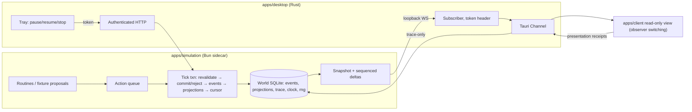
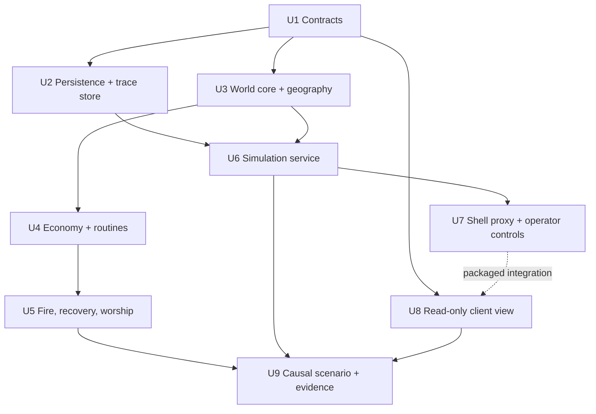

# feat: M1 persistent living world

## Overview

Build the authoritative simulation service that runs a small Greek world headless — rules, time, economy, destruction and recovery, worship/legend/favor records, SQLite persistence with snapshot/export/restore, and an always-on local causal trace — plus a thin read-only client view with observer switching across all three realms. No language models in M1.

## Problem Frame

M0 proved the stack on the baseline machine (see `docs/product/m0-exit.md`) but every product package is still a placeholder. M1 is the first milestone where the world must exist: committed state that the world engine alone owns, that keeps evolving with the window closed, that survives crashes and restarts without double-applying time, and whose consequences can be followed from cause to outcome. The roadmap's exit evidence is one causal scenario that continues headless, survives restart, and records inspectable consequences (`docs/product/mvp-roadmap.md`). Telemetry and persistence begin here and accompany every later stage; basic rendering attaches early enough to expose interaction problems.

## Requirements Trace

- **P03** — Workspace stays Bun-managed; the simulation sidecar is built from `apps/simulation`, not the M0 probe.
- **W02** — Town/wilderness, Olympus, and Underworld exist as location graphs; continuous town↔wilderness traversal; one in-world realm transition; observer switching changes only the camera.
- **W03** — Committed actions continue offscreen and with the window closed; return shows changes and a summary.
- **W05** — False claims, malformed proposals, stale targets, spent resources, dead actors, and insufficient power fail at execution time without corrupting state.
- **W06** — Inhabitants gather, produce, trade, and consume; goods and money change; different drives produce different decisions.
- **W07** — Balances, worship events, attributed legends, and an applied favor effect are inspectable; rumor is distinguishable from verified event.
- **W08** — A strike damages a tree and burns a building; service, inventory, and income change; rebuilding consumes resources through a motivated actor.
- **O01** — Autosave, snapshot, export, import, and restore of world state; IDs and state preserved; incompatible or corrupt imports rejected clearly without touching existing worlds.
- **O03** — Pause survives restart; missed-time cap and summary work; time is never advanced twice after a crash.
- **O04 (partial)** — Follow an event from observation through proposal, validation, outcome, and presentation. M1 delivers that chain; the model-request and relationship-change links are M2's remainder, and traceability records O04 as partially implemented until then.

Acceptance trials exercised in M1 form: A02 (divine consequence, without memories/reactions), A03 (recovery), A07 (absence, routine NPCs only), A08 (catch-up), A14 (save/restore, world state only), A16 (local causal chain only).

## Scope Boundaries

- No language models, prompts, or provider routing; intents come from scripted routines and fixture proposals.
- No seven-god cast, character memory, relationships, knowledge isolation, or director (M2).
- No player mortal, dialogue, combat, death/afterlife, or input authority in the client (M3).
- No generated behaviors, asset registry, or image generation; export/restore covers world state only (M4/M6 extend it). An archive carries projections, the event log with causation/correlation IDs, clock, PRNG state, and the manifest; it excludes diagnostic trace payloads, rejection details, observation records, and presentation receipts.
- No fast-forward UI (accepted default: pause and normal speed only).
- No external telemetry export; ADR-0006's export adapter stays proposed.

### Deferred to Separate Tasks

- Heavy-work memory-sharing re-measurement (B, C, D@5 GiB, 3–5 GiB thresholds, idle-window scheduling): separate coexistence follow-up probe.
- Packaged fresh-canvas device-loss recovery verification and the manual `pmset sleepnow` spot-check: separate renderer/lifecycle follow-up probes; the view implements the recovery path but this plan does not claim packaged proof of it.
- Four platform re-checks from `docs/product/m0-exit.md` (second WebGL2 GPU, signed macOS 15, macOS 26 WebGPU, Windows/Linux packaged).
- glib ≥ 0.20 Dependabot alert: blocked on a Tauri major.

## Context & Research

### Relevant Code and Patterns

- `tools/probes/backend-lifecycle/src/clock.ts` — at-most-once elapsed-time application against a persisted cursor; lift into the product (probe copy stays as evidence).
- `tools/probes/backend-lifecycle/src/lock.ts` — duplicate-start refusal, stale-lock reclaim, parent-death self-termination, `0600` lock mode.
- `tools/probes/backend-lifecycle/src/sidecar.ts` — bearer-token gating, WAL `bun:sqlite`, `0700`/`0600` modes, tick + cursor + event commit in one transaction.
- `tools/probes/backend-lifecycle/scripts/{build-sidecar,lifecycle,scan-binary}.sh` — compiled-sidecar build, hard-asserted transition harness, host-leak binary scan.
- `apps/desktop/src-tauri/src/lib.rs` — tray supervision, per-launch stdin token, restart backoff, orphan guard, single-instance-first registration.
- `apps/probe-renderer/src/Scene.tsx`, `metrics.ts` — `WebGPURenderer` with `forceWebGL`, manual raycast, pixel-perfect camera, deterministic `mulberry32` layout, context-loss gating, Flatland effect fallback.
- `tools/probes/shared/src/schema.ts` — hand-written parse-don't-validate action parser; `redact.ts`/`report.ts` for artifact redaction and report rendering.
- Placeholder packages (`packages/*/src/index.ts`) follow one pattern: a `status` export plus a co-located `index.test.ts`; tests run under `bun test`.

### Institutional Learnings

- `docs/solutions/2026-09-27-koota-new-function-tauri-csp.md` — any packaged surface importing `three-flatland` needs `script-src 'unsafe-eval'`; `tauri dev` and browser previews hide the failure.
- `docs/solutions/2026-09-26-wkwebview-webgpu-unavailable-macos-15.md` — WebGL2 is the baseline in packaged WKWebView on macOS 15.
- `docs/solutions/2026-09-27-three-webgpurenderer-device-loss-latch.md` — renderer instances latch after context loss; recovery is dispose → fresh canvas → new renderer → rebuild (upstream: mrdoob/three.js#34682).
- `docs/solutions/2026-09-27-ollama-runner-pid-rss-sampling.md` — supervise and sample the real child process, not a wrapper PID.
- `docs/solutions/2026-09-27-tcpdump-sudo-pid-resolution-offline-proof.md` — negative claims ("no double-apply") need owned, falsifiable evidence with a positive control.
- `tools/probes/sandbox/README.md` — a Bun `Worker` is not an isolation boundary; the sidecar stays a subprocess.
- `tools/probes/backend-lifecycle/README.md` — launch token is per-launch, stdin-only, never on disk, in logs, or in artifacts.

### External References

- Bun `bun:sqlite`: nested `transaction()` → savepoints; `.immediate()`/`.exclusive()`; `serialize()`/`Database.deserialize()`; macOS uses Apple SQLite with persistent WAL — disable via `SQLITE_FCNTL_PERSIST_WAL` and checkpoint/truncate before close (https://bun.sh/docs/runtime/sqlite). `VACUUM INTO`/online backup not documented for 1.4.2.
- SQLite `PRAGMA user_version`, `integrity_check`/`quick_check`, STRICT tables (https://sqlite.org/pragma.html, https://www.sqlite.org/stricttables.html).
- Bun WebSockets: `ws.send` backpressure return codes, `drain`, pub/sub (https://bun.sh/docs/runtime/http/websockets).
- Tauri 2 Channels are the recommended streaming path to the frontend; events are for small, low-rate payloads (https://v2.tauri.app/develop/calling-frontend).
- Event-sourced log + snapshots with rebuildable projections; causation/correlation IDs; snapshot + sequenced delta sync with resync on gap (Factorio FFF-270/55; LiveStore event-sourcing docs; OpenTelemetry context propagation).

## Prior-Art Survey

```json
{
  "schema_version": 2,
  "verdict": "extend",
  "scope": "repo root (apps/, packages/, tools/, content/)",
  "freshness": {
    "vcs_reference": "2bb428e88c8ff992b7725f7676ada17f60c3b7f0"
  },
  "budget": {
    "max_search_passes": 3,
    "max_candidate_inspections": 15,
    "exhausted": false
  },
  "candidates": [
    {
      "path_or_symbol": "tools/probes/backend-lifecycle/src/sidecar.ts",
      "description": "Bun sidecar with bearer gating, bun:sqlite WAL storage, events/clock tables, 1 Hz tick, and cursor advancement in one transaction.",
      "disposition": "extend"
    },
    {
      "path_or_symbol": "tools/probes/backend-lifecycle/src/clock.ts",
      "description": "Elapsed-wall-clock helper that applies a persisted cursor at most once across crash/restart boundaries.",
      "disposition": "reuse"
    },
    {
      "path_or_symbol": "tools/probes/backend-lifecycle/src/lock.ts",
      "description": "Lifecycle lock for duplicate-start refusal, stale-lock recovery, and parent-death self-termination.",
      "disposition": "reuse"
    },
    {
      "path_or_symbol": "apps/desktop/src-tauri/src/lib.rs",
      "description": "Tauri shell supervisor: sidecar launch, per-launch stdin token, restart backoff, tray and exit behavior.",
      "disposition": "extend"
    },
    {
      "path_or_symbol": "apps/desktop/src-tauri/tauri.conf.json",
      "description": "Desktop config that builds the sidecar and constrains CSP/IPC surfaces.",
      "disposition": "extend"
    },
    {
      "path_or_symbol": "apps/simulation/src/index.ts",
      "description": "Loopback Bun HTTP skeleton with /health and shutdown wiring.",
      "disposition": "extend"
    },
    {
      "path_or_symbol": "packages/contracts/src/index.ts",
      "description": "Placeholder for versioned command, event, content, and save schemas.",
      "disposition": "insufficient",
      "insufficiency_reason": "Status stub only; no schemas exist."
    },
    {
      "path_or_symbol": "packages/persistence/src/index.ts",
      "description": "Placeholder for transactions, snapshots, migrations, replay.",
      "disposition": "insufficient",
      "insufficiency_reason": "Status stub only; no store, migrations, or snapshots exist."
    },
    {
      "path_or_symbol": "packages/telemetry/src/index.ts",
      "description": "Placeholder for correlation, local inspection, export adapters.",
      "disposition": "insufficient",
      "insufficiency_reason": "Status stub only; no trace store or query exists."
    },
    {
      "path_or_symbol": "apps/client/src/App.tsx",
      "description": "Full-window canvas placeholder with no state subscription.",
      "disposition": "insufficient",
      "insufficiency_reason": "No renderer, state store, or event-stream wiring."
    }
  ]
}
```

## Key Technical Decisions

- **State model: append-only event log is the source of truth; projection tables are updated in the same transaction and are rebuildable from the log; snapshots are a restore/speed artifact, never authority.** Unifies replay, restore, and causal inspection; a rebuild-equals-live test catches projection drift.
- **One tick = one `IMMEDIATE` SQLite transaction** that revalidates and commits queued actions sequentially, appends events, updates projections, and advances the clock cursor. Sequential in-transaction validation makes same-tick double-spend impossible and makes crash recovery a rollback to the last committed tick.
- **Execution-time validation with expected revisions.** Every proposal names actor, targets, preconditions, required capabilities, costs, and the entity revisions it expects; a mismatch at execution is a recorded rejection with a reason code, and the actor may replan. Claims never mutate state.
- **Time:** 1 wall second = 1 sim second, 1 Hz live tick. Catch-up caps at one hour of missed wall time, runs coarse steps through the same validator, commits in cancellable chunks with the cursor advanced inside each chunk's transaction, marks every catch-up event as approximate, and produces a summary (applied, skipped, major outcomes). Pause is persisted; paused wall time never becomes catch-up. Backward clock jumps apply zero and never move the cursor back. All numbers live in documented configuration, not code.
- **Determinism boundary:** only persisted world state, persisted PRNG state, versioned content, and recorded operator events influence outcomes. Wall-clock time (beyond the cursor's elapsed interval), filesystem metadata, host ordering, and transport timing are never inputs to world logic. A seeded PRNG persisted in the world store drives every random rule, so replays and restored snapshots continue identically. M2 model outputs stay proposals until stored and revalidated.
- **Scheduling:** routines run against the last committed state only. Each tick drains the previous tick's queue, revalidates and commits eligible proposals, then routines enqueue proposals for the next tick. Nothing observes uncommitted same-tick effects; M2 model proposals join the same queue.
- **Versioning has two independent axes:** `user_version` governs only the SQLite schema; proposals, events, snapshots, and archive payloads carry their own schema versions. `packages/contracts` owns upcasters so live execution, rebuild, replay, and import all decode through one compatibility pipeline, and `packages/world` consumes only latest-form events.
- **Projection ownership:** `packages/world` owns event reducers and projection definitions and never depends on SQLite; `packages/persistence` owns transactions, storage, snapshot/export/import, and projection application/rebuild by calling world reducers.
- **Contracts are hand-written parse-don't-validate parsers** in `packages/contracts`, following `tools/probes/shared/src/schema.ts`. No new runtime dependency; revisit only if the parser surface grows past maintainability in M2.
- **Persistence layout:** one SQLite database per world slot under the app-data directory (`0700` dir, `0600` files), WAL with macOS persistent-WAL disabled, STRICT tables, `user_version` migrations, checkpoint at most every 60 s plus clean shutdown. `synchronous=NORMAL` is acceptable because effects and the cursor commit atomically: a power loss can drop the last ticks together with their cursor advance (re-applied once), never apply an interval twice. Slot IDs are service-generated; no path component ever comes from an archive or request.
- **Upgrades:** existing slots migrate forward in place through ordered `user_version` migrations taken after a pre-migration snapshot; a slot that cannot migrate is left untouched and reported.
- **Export archive = a single self-describing SQLite file** captured at a committed tick boundary (one read transaction pinned to a recorded event sequence), carrying a manifest table: format version, SQLite and payload schema versions, world ID, event sequence, and a content hash. The hash covers a canonical dump: fixed table order, rows ordered by primary key, explicit UTF-8/NULL encoding, normalized numbers, and no page layout or rowid artifacts.
- **Import treats archives as hostile bytes.** The archive is opened read-only in a temporary location, `integrity_check` runs, the schema must match an explicit allowlist (no triggers, views, virtual tables, or attachments), the manifest parses, versions are compatible or upcastable, and the hash recomputes. Validated rows are then copied into a fresh slot database created by our own migrations in a staging directory, fsynced, and atomically renamed into place. The attacker file is never adopted as a database. Restore of a snapshot follows the same staging path into a new branch slot. Nothing overwrites an existing world, which removes the import-while-running race and satisfies "invalid imports preserve existing worlds"; any failure, including disk-full, removes the staging artifact.
- **Causal trace:** every event carries event ID, sequence, correlation ID, and causation ID; proposals (accepted and rejected) are first-class trace records; presentation receipts from the client are appended to a trace-only table that cannot mutate world state. Causal links live with world history (retained with the world); detailed diagnostic payloads use the seven-day retention default, and pruning drops payload bodies only — causal edges and tombstones stay, so follow-event queries return an explicit "payload expired" marker rather than a broken chain. Exports and trace-query responses pass through the shared redaction harness.
- **Transport: the webview never holds the sidecar token.** The sidecar binds only to `127.0.0.1` and serves authenticated HTTP + WebSocket; the Rust shell, which already owns the token, subscribes with a header and forwards snapshot + sequenced deltas to the webview over a Tauri Channel. The sidecar rejects any request or upgrade lacking the token, carrying an `Origin` or `Sec-Fetch-*` header (browser-originated, covering DNS-rebinding and CSRF), or with a `Host` other than its own loopback address. Every sidecar spawn mints a fresh token and increments a session generation; the shell closes prior subscriptions and the client drops any frame from an older generation. `connect-src` stays IPC-only.
- **Proposal intake is bounded now, before M2 makes it a model path:** every proposal carries source, schema version, and (reserved) model-request ID; oversized payloads, unknown sources, and per-tick counts above a configured cap are rejected; trace stores bounded metadata, not raw bodies beyond retention.
- **Desktop CSP adds `script-src 'unsafe-eval'`** (owner-approved 2026-09-27) for three-flatland/koota, per ADR-0002. Blast radius is bounded: the webview holds no credentials, has no network reach beyond Tauri IPC, holds one dedicated capability for the Channel command, and treats every Channel payload as untrusted data parsed through contracts — no `eval`, `new Function`, or `innerHTML` on received content.
- **Operator controls** (pause, resume, stop background) are tray-menu actions in the shell, recorded as operator events distinct from character actions (D11). The client view has no input authority; observer selection is client-local state.
- **Observation records:** before proposing, a routine or fixture records what it observed (the committed state revision and the facts it read) as a trace record; the proposal cites it as its cause. This is the first hop of the O04 chain and the seam M2 perception fills.
- **Endpoint access matrix:**

  | Caller | Allowed |
  |---|---|
  | Shell (operator) | pause/resume/stop, snapshot, export, import, restore, trace query, stream subscription |
  | Webview via shell | presentation receipts only |
  | Routines, fixtures, scenario harness | proposals (with their observation records) |

  Callers are distinguished by source on an authenticated request; every other combination is rejected and tested.
- **Import limits:** maximum archive bytes, row count, and wall-time budget come from configuration; an over-limit archive is rejected before staging with a clear error.
- **Operator surfaces (placeholder contracts; visual design by @designer during implementation):** the observer picks from an actor/location list grouped by realm; when the followed target dies, leaves existence, or becomes unreachable, the view holds the last location and says why. The catch-up summary is a dismissible panel in the view listing applied time, skipped time, and major outcomes. Degraded status is a persistent banner plus tray label; ticking is suspended while pause and export stay available. The tray shows running / paused / background / stopped with the current state marked.
- **Sidecar source moves to `apps/simulation`.** The desktop build compiles it via a product build script (reusing the probe's compile and binary-scan approach); the probe tree stays untouched as M0 evidence.

## Open Questions

### Resolved During Planning

- Client transport: Rust-proxied Tauri Channel (token never reaches the webview), per Tauri's streaming guidance.
- Desktop `unsafe-eval`: accepted by the owner for the Flatland-based view.
- Import/restore semantics: always into a new world slot; existing worlds are never overwritten.
- Pause during catch-up: stop at the last committed chunk boundary and record the remainder as skipped (`docs/product/defaults.md` "Catch-up responsiveness").
- Legends without models: a legend is an attributed narrative record with an optional link to a verified event; unlinked records are rumors; a rumor becomes verified only when linked to a committed event.

### Deferred to Implementation

- Exact coarse-step and chunk sizes for catch-up: tune against the 1-hour cap and responsiveness on the baseline machine; record chosen values in configuration docs.
- Fire spread rates, per-zone burn bounds, and repair costs: balance values set in content data and adjusted from scenario observation.
- Economy stabilizers (fixed floor/ceiling prices at the shop/tavern vs. pure NPC-to-NPC trade): choose the minimum that keeps the scenario's currency and goods conserved and non-degenerate over the one-hour trial.
- Whether presentation receipts are batched per frame or per event: decide after measuring Channel throughput.
- `SQLITE_FULL` behavior details beyond "suspend ticking, surface degraded status, never partially commit".

## Output Structure

    apps/simulation/
      scripts/build-sidecar.sh
      src/{index,lifecycle,server,tick,catchup,worlds}.ts (+ .test.ts)
    packages/contracts/src/{ids,proposal,event,snapshot,archive,content}.ts (+ .test.ts)
    packages/persistence/src/{store,migrations,clock,snapshot,archive}.ts (+ .test.ts)
    packages/telemetry/src/{trace,query}.ts (+ .test.ts)
    packages/world/src/{state,geography,actions,validate,economy,routines,fire,repair,worship}.ts (+ .test.ts)
    packages/content/src/{load}.ts (+ .test.ts)
    content/greek/world/{locations,buildings,inhabitants,rules}.json
    apps/client/src/{connection,store,observer,renderer,recovery}.ts(x)
    tools/scenarios/m1-living-world/{README.md, src/run.ts, src/fixtures/*.json}

## High-Level Technical Design

> *This illustrates the intended approach and is directional guidance for review, not implementation specification. The implementing agent should treat it as context, not code to reproduce.*



Action lifecycle: `proposed → queued → revalidated at execution → committed | rejected(reason)`; rejection is recorded and the actor may replan. Building lifecycle: `operational → damaged → burning → destroyed → repairing → operational`, with services, inventory, and income derived from state.

## Implementation Units



### Phase A — Foundations

- [x] **Unit 1: Versioned contracts**

**Goal:** Define and parse every M1 wire and storage shape: entity/world IDs, observation records, proposals, events (with correlation/causation), rejection reasons, snapshots and deltas with sequence numbers, archive manifest, and content data.

**Requirements:** W05, O01, O04, P03

**Dependencies:** None

**Files:**
- Modify: `packages/contracts/src/index.ts`, `packages/contracts/package.json`
- Create: `packages/contracts/src/{ids,proposal,event,snapshot,archive,content}.ts`
- Test: `packages/contracts/src/{proposal,event,snapshot,archive,content}.test.ts`

**Approach:**
- Discriminated unions for proposal and event kinds; each carries a schema version; parsers return a typed result or a structured error, never throw on untrusted input.
- Proposal shape includes actor, targets, preconditions, capabilities, costs, and expected entity revisions; a `source` field distinguishes routine, fixture, operator, and (reserved for M2) model, with a reserved model-request ID. Parsers enforce a byte limit.
- Upcasters decode every prior payload version to the latest form.
- Content schema covers locations/edges/realms, buildings, inhabitants, resource graph, and numeric rules.

**Execution note:** Implement test-first.

**Patterns to follow:** `tools/probes/shared/src/schema.ts`.

**Test scenarios:**
- Happy path: a valid move/gather/trade/strike/repair/worship proposal parses to its typed variant.
- Error path: missing actor, unknown kind, non-numeric cost, extra authority fields (e.g., a claim that asserts an inventory grant) → structured rejection naming the field.
- Edge case: unsupported schema version → incompatible-version error distinct from malformed-payload error.
- Edge case: delta with non-integer or negative sequence rejected.
- Happy path: archive manifest round-trips; a manifest missing the content hash fails.
- Happy path: an event written in a previous payload version upcasts to the latest form.
- Error path: proposal over the byte limit or with an unknown source is rejected.

**Verification:** All M1 shapes have a parser with tests; `bun run check` green.

- [x] **Unit 2: Persistence and causal trace store**

**Goal:** A per-world SQLite store with migrations, atomic tick commits, event log + projections, persisted clock cursor and PRNG state, checkpointing, snapshots, archive export/import into a new slot, and a trace store with a "follow this event" query.

**Requirements:** O01, O03, O04, W03

**Dependencies:** Unit 1

**Files:**
- Modify: `packages/persistence/src/index.ts`, `packages/telemetry/src/index.ts`
- Create: `packages/persistence/src/{store,migrations,clock,snapshot,archive}.ts`, `packages/telemetry/src/{trace,query}.ts`
- Test: `packages/persistence/src/{store,migrations,clock,snapshot,archive}.test.ts`, `packages/telemetry/src/{trace,query}.test.ts`

**Approach:**
- Lift `clock.ts` semantics (at-most-once elapsed application; backward jumps apply zero) and extend with pause state and the catch-up cap.
- Store opens with WAL, persistent-WAL disabled on macOS, enforced `0700`/`0600` modes, STRICT tables, `user_version` migrations applied in a transaction.
- Projections are written in the same transaction as their events by applying `packages/world` reducers; a rebuild routine replays the log into fresh projections.
- Snapshot = consistent read pinned to an event sequence; export adds the manifest and canonical content hash; import follows the hostile-archive path in Key Technical Decisions (allowlist, row copy into a staged fresh DB, atomic rename).
- Migrations take a pre-migration snapshot and run in one transaction.
- Retention pruning removes payload bodies and keeps causal edges and tombstones.
- Trace: observation records, proposals, rejections, events, and presentation receipts linked by correlation/causation IDs; the query walks causes and effects from any event ID; presentation receipts are append-only and have no path to world tables.

**Execution note:** Characterize lifted clock/lock behavior with the probe's existing tests before extending.

**Patterns to follow:** `tools/probes/backend-lifecycle/src/{clock,sidecar}.ts`.

**Test scenarios:**
- Happy path: commit N ticks; rebuild projections from the log; projections equal live projections.
- Integration: a transaction that throws mid-tick leaves events, projections, cursor, and PRNG state unchanged.
- Edge case: cursor applies an elapsed interval exactly once across simulated crash/reopen; backward wall clock applies zero and keeps the cursor.
- Edge case: paused interval produces no catch-up after reopen; pause flag survives reopen.
- Happy path: export → import creates a new slot with identical IDs, event sequence, projections, and PRNG state; the source slot is untouched.
- Error path: truncated file, flipped byte in payload, wrong schema version, missing manifest → each rejected with a distinct clear error; no slot created; existing slots unchanged.
- Happy path: follow-event query returns proposal → validation → event → projection change → presentation receipt in order; a rejected proposal returns its reason.
- Error path: presentation receipt referencing an unknown event is stored as orphaned trace, never mutates world tables.
- Edge case: export while ticking always reflects one committed sequence; the manifest sequence matches the archive contents.
- Happy path: the same world exported twice, or copied across machines, yields the same content hash.
- Error path: archive containing a trigger, view, virtual table, or an unexpected table is rejected before any slot is created.
- Error path: archive over the configured byte, row, or time limit is rejected before staging.
- Happy path: export contains event log and causal IDs but no observation records, rejection details, or presentation receipts.
- Happy path: follow-event from the strike returns observation → proposal → validation → event → projection change → presentation receipt.
- Happy path: a slot and an archive written by the previous schema version both migrate forward without loss; an unsupported older format is rejected and its source is untouched.
- Edge case: after retention pruning, follow-event still walks the full chain and marks expired payloads.

**Verification:** Store, snapshot, archive, and trace behaviors covered; file modes asserted in tests.

- [x] **Unit 3: World core, geography, and action pipeline**

**Goal:** Entities, three-realm location graphs, simulation time, the action queue, and execution-time validation for movement and realm transition.

**Requirements:** W02, W05

**Dependencies:** Unit 1

**Files:**
- Modify: `packages/world/src/index.ts`, `packages/content/src/index.ts`
- Create: `packages/world/src/{state,geography,actions,validate}.ts`, `packages/content/src/load.ts`, `content/greek/world/{locations,rules}.json`
- Test: `packages/world/src/{geography,actions,validate}.test.ts`, `packages/content/src/load.test.ts`

**Approach:**
- World rules are pure functions over a state view and a proposal, returning committed events or a rejection; persistence stays outside `packages/world` so rules are testable without SQLite.
- Realm identity is separate from map identity; town and wilderness share one continuous graph; Olympus and Underworld are separate graphs joined by an authored transport element.
- Durations: actions occupy an actor until completion; an actor cannot hold two resource-consuming actions at once.
- Content loads through Unit 1 parsers; invalid content fails loudly at startup.

**Execution note:** Implement domain rules test-first.

**Test scenarios:**
- Happy path: actor walks wilderness → town along adjacent edges; each step is an event.
- Happy path: actor uses the transport element and arrives in the Underworld; realm and location change in one event.
- Error path: move to a non-adjacent node, into a restricted realm without capability, or by a dead actor → rejected with reason; state unchanged.
- Error path: expected target revision no longer matches (target moved) → stale-target rejection.
- Edge case: two proposals from one actor in the same tick spending the same capacity → first commits, second rejected.
- Error path: malformed fixture proposal and a false claim ("I own the tavern") → rejected; no state change.
- Happy path: authored Greek content loads; a location referencing an unknown realm fails load with a clear message.

**Verification:** Rules run headless in unit tests; content validates.

### Phase B — World systems

- [ ] **Unit 4: Economy and inhabitant routines**

**Goal:** The minimal resource graph (currency, food, materials, trade goods), buildings with ownership/inventory/services, and scripted routines that gather, produce, trade, and consume under differing drives.

**Requirements:** W06, W07 (balances), W03

**Dependencies:** Unit 3

**Files:**
- Create: `packages/world/src/{economy,routines}.ts`, `content/greek/world/{buildings,inhabitants}.json`
- Modify: `content/greek/world/rules.json`
- Test: `packages/world/src/{economy,routines}.test.ts`

**Approach:**
- Every economic change is a validated action producing events; routines only propose, and each proposal cites the observation record it was made from.
- Drives are data (e.g., thrift vs. appetite vs. greed weights) that change routine choices deterministically under the seeded PRNG.
- Offscreen reduced detail aggregates routine cycles but must still emit the consequential resource changes and mark them approximate.

**Test scenarios:**
- Happy path: woodcutter gathers materials, sells to a buyer, buys food; balances and inventories change through events.
- Invariant: over a long run, currency and goods are conserved except at declared sources/sinks; the test enumerates them.
- Happy path: two inhabitants with different drives choose different actions from the same state.
- Error path: purchase with insufficient currency or from an out-of-stock building → rejected.
- Integration: coarse offscreen step produces the same resource totals as the equivalent fine steps within the documented tolerance, and events are marked approximate.

**Verification:** Economy runs unattended in tests without degenerate stalls; conservation holds.

- [ ] **Unit 5: Strike, fire, recovery, worship, legends, and favor**

**Goal:** A strike damages a tree and ignites a building; fire spreads by material/adjacency within bounds; services, inventory, and income respond; a motivated actor repairs with resources; worship events, attributed legends (rumor vs. verified), and a favor effect with source and duration exist.

**Requirements:** W07, W08, W05

**Dependencies:** Unit 4

**Files:**
- Create: `packages/world/src/{fire,repair,worship}.ts`
- Modify: `content/greek/world/{buildings,rules}.json`
- Test: `packages/world/src/{fire,repair,worship}.test.ts`

**Approach:**
- The strike is a fixture proposal from a divine actor with a power cost; insufficient power rejects it.
- Fire state lives in projections (intensity, ticks burning), never timers; spread checks are bounded per tick and use the persisted PRNG.
- A burning or destroyed building exposes no services and loses inventory per explicit disposition rules; income stops.
- Repair requires materials and an actor whose routine drive motivates it; progress is incremental events.
- Worship acts are observable events that feed a configurable divine-capacity rule; favor is an explicit effect with source and duration/removal; legends are attributed narratives, optionally linked to a verified event.

**Test scenarios:**
- Happy path: strike near the tavern damages the tree and ignites the tavern; tavern services disappear; inventory is disposed per rule; income stops.
- Edge case: spread respects the per-tick and per-zone bounds; a non-combustible neighbor never ignites.
- Integration: the same seed and state produce the same fire outcome after snapshot/restore.
- Happy path: repair consumes materials over several ticks and restores services; without materials the repair is rejected.
- Error path: strike with insufficient divine power → rejected; no damage.
- Happy path: worship event increases divine capacity per rule; favor applies with source and expires at its duration.
- Happy path: an unlinked legend is a rumor; linking it to the strike event marks it verified; a disputed second version coexists.

**Verification:** The A02/A03 consequence chain holds in unit/integration tests.

### Phase C — Service and shell

- [ ] **Unit 6: Simulation service**

**Goal:** Turn `apps/simulation` into the authoritative sidecar: lifecycle, tick loop, pause, capped chunked catch-up with summary, autosave, world slots, authenticated API and stream, and the product sidecar build.

**Requirements:** W03, O01, O03, O04, P03

**Dependencies:** Units 2, 3 (Units 4–5 plug in as they land)

**Files:**
- Modify: `apps/simulation/src/index.ts`, `apps/simulation/package.json`, `apps/desktop/src-tauri/tauri.conf.json` (sidecar build command)
- Create: `apps/simulation/src/{lifecycle,server,tick,catchup,worlds}.ts`, `apps/simulation/scripts/build-sidecar.sh`
- Test: `apps/simulation/src/{lifecycle,server,tick,catchup,worlds}.test.ts`

**Approach:**
- Lift lock, stdin token, stdin-EOF and parent-PID orphan guards from the probe; token never logged or persisted.
- HTTP endpoints for proposals (routine/fixture/operator sources), pause/resume, snapshot, export/import/restore, trace query, and presentation receipts; WebSocket stream sends a snapshot then sequenced deltas and honors `send` backpressure (slow subscriber gets a resync marker rather than unbounded buffering).
- Catch-up runs on start and on resume-from-sleep, chunked and cancellable, checking pause between chunks, and emits a summary event (applied, skipped, major outcomes) that the shell and view render.
- Endpoints enforce the access matrix in Key Technical Decisions; import applies configured limits before staging.
- Disk-full or store errors suspend ticking and expose degraded status; nothing partially commits.
- Import and restore run through the staging-then-atomic-rename path; the slot index lists only fully materialized slots.
- Request guards: loopback bind, token, `Host` check, and rejection of browser-originated requests (`Origin`/`Sec-Fetch-*`); presentation receipts are idempotent per event and session, rate-limited, and duplicates dropped.
- Build script compiles the sidecar and runs the binary host-leak scan.
- Projection storage: Phase A persists world projections as one JSON document rewritten every tick (per-tick cost scales with world size). Unit 6 replaces it with per-entity rows or dirty-subtree writes once real projections from Units 4–5 exist, and measures commit cost against the 1 Hz budget.

**Patterns to follow:** `tools/probes/backend-lifecycle/src/{lock,sidecar}.ts`, `tools/probes/backend-lifecycle/scripts/{build-sidecar,scan-binary}.sh`.

**Test scenarios:**
- Error path: request without or with the wrong token → 401; token absent from logs.
- Integration: kill during a catch-up chunk; restart resumes from the last committed chunk; total applied time never exceeds the cap; no interval applied twice.
- Edge case: pause during catch-up stops at the chunk boundary and records the remainder as skipped; pause persists across restart.
- Edge case: missed time above the cap → exactly one hour applied, excess reported as skipped.
- Happy path: stream subscriber receives a snapshot then gapless deltas; a subscriber that falls behind receives a resync marker.
- Error path: each caller attempting an endpoint outside its access-matrix row is rejected (e.g., a proposal-source caller requesting export, a receipt caller submitting a proposal).
- Happy path: import of a valid archive while running creates a new slot and does not disturb the active world.
- Error path: simulated store write failure suspends ticking and reports degraded status.
- Error path: simulated disk-full during import or restore leaves the active world unchanged and no partial slot behind.
- Error path: requests carrying an `Origin` header, a foreign `Host`, or a previous session's token are rejected (DNS-rebinding/CSRF and stale-token abuse cases).
- Error path: a receipt flood is capped; duplicates are not persisted; trace size stays bounded.

**Verification:** Service passes tests headless; compiled binary passes the host-leak scan.

- [ ] **Unit 7: Shell proxy and operator controls**

**Goal:** The Rust shell subscribes to the sidecar stream with the token, forwards it to the webview over a Tauri Channel, relays presentation receipts, handles sidecar restarts with a resync, and exposes pause/resume/stop-background in the tray as recorded operator events.

**Requirements:** W03, O03, O04

**Dependencies:** Unit 6

**Files:**
- Modify: `apps/desktop/src-tauri/src/lib.rs`, `apps/desktop/src-tauri/Cargo.toml` (only if a WebSocket client crate is required; ask before adding), `apps/desktop/src-tauri/capabilities/default.json`, `apps/desktop/src-tauri/tauri.conf.json` (CSP `'unsafe-eval'`)
- Test: Rust unit tests in `apps/desktop/src-tauri/src/lib.rs` (or a sibling module)

**Approach:**
- A dedicated capability grants the main window only the Channel command; no shell, filesystem, network, or other plugin permission is added to the renderer.
- On sidecar restart the proxy re-subscribes and emits a session-change marker so the client drops local state and takes the new snapshot.
- Window close keeps ticking (background mode); the tray shows running / paused / background / stopped with the current state marked, plus a degraded label when the sidecar reports it; stop-background and quit remain explicit.

**Test scenarios:**
- Happy path: frames from the sidecar reach the Channel in order.
- Integration: sidecar killed and restarted by the supervisor → client receives a session-change marker then a fresh snapshot.
- Error path: webview-originated message other than a presentation receipt is refused.
- Error path: after a sidecar restart, frames and receipts tagged with the old session generation are dropped.
- Error path: the renderer cannot invoke any Tauri command other than the Channel command.
- Happy path: tray pause/resume produce operator events visible in the trace, and the tray's marked state follows the sidecar's reported state.

**Verification:** `cargo fmt --check` and `cargo clippy -- -D warnings` clean; packaged app streams state with the token absent from the webview.

### Phase D — View and evidence

- [ ] **Unit 8: Read-only client view with observer switching**

**Goal:** A Flatland-based view (WebGL2 baseline, WebGPU where available) that renders placeholder town, wilderness, Olympus, and Underworld layouts from live state, shows actors, buildings, fire/damage, and resource changes as they commit, and switches the observer across actors and locations in all three realms without affecting the world.

**Requirements:** W02 (observer switching), O04 (presentation receipts), P02 carried constraints

**Dependencies:** Unit 1 (builds against recorded snapshot/delta fixtures); Unit 7 for packaged integration only

**Files:**
- Modify: `apps/client/src/{App.tsx,main.tsx}`, `apps/client/package.json`
- Create: `apps/client/src/{connection,store,observer,renderer,recovery}.ts(x)`
- Test: `apps/client/src/{store,observer}.test.ts`

**Approach:**
- The store applies snapshot + deltas; on a gap or session change it discards state and requests a snapshot.
- Placeholder layouts are generated from location graphs; the town gets the fuller placeholder scene.
- Observer follows an actor across realm transitions by switching the rendered graph; following never sends anything that could affect world state.
- Operator surfaces follow the placeholder contracts in Key Technical Decisions: realm-grouped target picker, lost-target hold with reason, catch-up summary panel, degraded banner. @designer owns their visual treatment.
- The store and receipt emitter run without a renderer so the scenario can drive them headlessly.
- Device loss follows the documented recovery path (dispose, fresh canvas, new renderer, rebuild from the store); packaged proof stays with the deferred renderer probe.
- Presentation receipts are sent once per rendered event and session generation.
- All Channel payloads are parsed through contracts before use; received content never reaches an eval-capable sink or `innerHTML`.

**Patterns to follow:** `apps/probe-renderer/src/{Scene.tsx,metrics.ts}`.

**Test scenarios:**
- Happy path: snapshot then deltas produce the expected view model.
- Edge case: delta with a skipped sequence triggers resync; stale deltas after resync are ignored.
- Edge case: session-change marker clears state before the new snapshot applies.
- Happy path: following an actor through the Underworld transition switches the rendered realm; the actor's world location comes only from events.
- Edge case: the followed actor dies or is removed → view holds the last location and shows the reason; picking a new target resumes following.
- Happy path: a catch-up summary event opens the summary panel; a degraded status shows the banner until cleared.
- Integration: the view model after a device-loss rebuild equals the pre-loss view model.

**Verification:** Separate M1 view gate, required before M1 is marked complete but independent of the headless causal proof: the packaged `.app` shows live state with observer switching across all three realms (window-cropped screenshots only) and no CSP errors in Web Inspector.

- [ ] **Unit 9: M1 causal scenario and evidence**

**Goal:** A headless scenario that drives the compiled sidecar through the full M1 causal story and hard-asserts every requirement, plus the docs, ADR, and traceability updates that record it.

**Requirements:** P03, W02, W03, W05, W06, W07, W08, O01, O03, O04

**Dependencies:** Units 5, 6, 8

**Files:**
- Create: `tools/scenarios/m1-living-world/{README.md,src/run.ts,src/fixtures/*.json}`, `docs/decisions/0008-world-state-and-client-transport.md`
- Modify: `tools/scenarios/package.json`, `tools/scenarios/README.md`, `docs/decisions/README.md`, `docs/decisions/0006-telemetry-export.md` (local store accepted, export still proposed), `docs/decisions/0002-renderer-backend.md` (desktop CSP), `docs/product/traceability.md`, `docs/product/mvp-roadmap.md` (M1 outcome)
- Test: the scenario itself exits non-zero on the first violated invariant

**Approach:**
- Spawn the compiled sidecar with a stdin token (no Tauri) and run: seed world → unattended routines → strike → fire → lost service → repair → worship/legend/favor → fixture malformed/false/stale proposals → pause, restart, verify pause held → kill mid-catch-up, restart, verify single application → export, corrupt copy, import both, restore snapshot into a branch → drive the client store headlessly to emit presentation receipts → trace query from the strike's observation record through presentation.
- The scenario is the headless causal proof; the packaged view check in Unit 8 is a separate gate, and both are required before the roadmap marks M1 complete.
- Report uses the shared redaction/report harness; evidence records positive controls for negative claims.

**Patterns to follow:** `tools/probes/backend-lifecycle/scripts/lifecycle.sh`, `tools/probes/shared/src/{report,redact}.ts`.

**Test scenarios:**
- Integration: every step above asserts its invariant and the run exits zero only when all hold.
- Error path: deliberately corrupting the invariant check (positive control) makes the scenario fail, proving the assertions are live.

**Verification:** Scenario passes on the baseline machine; traceability rows for all M1 IDs updated with implementation paths and evidence, with O04 recorded as partially implemented and its M2 remainder named.

## System-Wide Impact

- **Interaction graph:** sidecar ↔ shell (token, supervision, stream, tray controls) ↔ webview (Channel only). Scenario harness talks to the sidecar directly.
- **Error propagation:** rule rejections are events, not errors; store failures suspend ticking and surface degraded status; stream failures trigger resync, never partial client state.
- **State lifecycle risks:** crash mid-tick or mid-catch-up rolls back to the last commit; import/restore never overwrite; projection drift caught by rebuild tests.
- **API surface parity:** the proposal endpoint is the same path M2 model proposals will use; the trace schema reserves model-request links.
- **Security boundaries:** principals are the shell and the sidecar only; the webview is an untrusted data consumer with one capability; browsers and other local processes are untrusted callers of the loopback API; imported archives are untrusted bytes.
- **Unchanged invariants:** the renderer decides nothing; generated code does not exist yet; offline-only operation with no network beyond loopback; token never leaves Rust and the sidecar.

## Risks & Dependencies

| Risk | Mitigation |
|------|------------|
| Event log grows unbounded over the eight-hour trial | Snapshots at checkpoints; log compaction deferred until retention policy work, but size is measured in the scenario report |
| Coarse catch-up diverges from live results | Same validator in both paths; tolerance test in Unit 4; approximation always marked |
| `'unsafe-eval'` in the main app | Owner-approved; webview has no credentials and IPC-only `connect-src`; revisit if koota drops `new Function()` |
| Rust WebSocket client needs a new crate | Ask before adding; fallback is SSE/HTTP streaming over the existing HTTP stack |
| Scope pull toward M2 (models, memory) | Scope Boundaries are explicit; proposal `source` reserves the model path without implementing it |
| Placeholder view mistaken for M5 presentation | View is labeled read-only placeholder in docs and roadmap |
| Local web page or process drives the loopback API | Token + `Host` check + browser-origin rejection; abuse tests in Unit 6 |
| Malicious archive executes SQL or escapes the slot root | Allowlisted schema, row copy into our own DB, service-generated slot paths |
| App upgrade strands existing worlds | Forward migrations with pre-migration snapshot; unmigratable slots left untouched and reported |
| Half-written slot after crash or disk-full | Staging directory + fsync + atomic rename; staging cleanup on failure |

## Phased Delivery

- **Phase A (Units 1–3):** contracts, persistence/trace, world core — lands the headless rule engine.
- **Phase B (Units 4–5):** economy and consequences.
- **Phase C (Units 6–7):** the living service and shell integration.
- **Phase D (Units 8–9):** read-only view and the exit scenario.

Each phase is independently reviewable and updates `docs/product/traceability.md`.

## Documentation / Operational Notes

- New ADR-0008 records the event-log state model, new-slot import/restore semantics, and the Rust-proxied Channel transport.
- ADR-0002 gains the desktop CSP consequence; ADR-0006 moves its local-store portion to accepted.
- Tunable numbers (catch-up cap, chunk size, checkpoint interval, fire and economy balance) are documented in content/config, not code.
- The plan's docs PR also cites mrdoob/three.js#34682 in `docs/solutions/2026-09-27-three-webgpurenderer-device-loss-latch.md`, `docs/decisions/0002-renderer-backend.md`, and `tools/probes/renderer-webgl2/README.md`.

## Sources & References

- Roadmap and authority: `docs/product/{mvp-roadmap,requirements,simulation-direction,defaults,acceptance,m0-exit,open-decisions}.md`
- ADRs: `docs/decisions/0002-renderer-backend.md`, `docs/decisions/0003-simulation-service.md`, `docs/decisions/0006-telemetry-export.md`
- Probe evidence: `tools/probes/backend-lifecycle/README.md`, `tools/probes/renderer-webgl2/README.md`, `tools/probes/sandbox/README.md`
- Upstream: https://github.com/mrdoob/three.js/issues/34682
