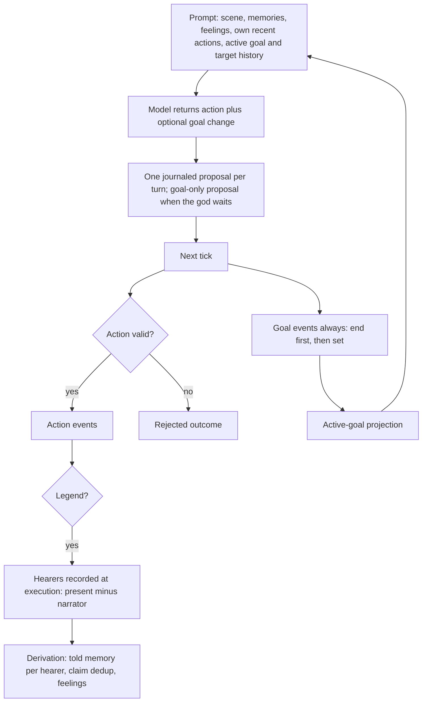

# feat: Gods that pursue goals

## Overview

Each god keeps one private goal across turns. The goal is written in the god's own words, names one target, and ends only when the god declares it achieved, failed, or abandoned. Each turn's prompt shows the goal, what has happened with its target, and the god's own recent words and actions. Legends become public tellings that give every listener present a told memory, and their claims shift feelings. The M2 experience gate is then rerun on both models with goal checks added.

## Problem Frame

The owner rated all three M2 experience-gate episodes replan. On llama3.2 3B, conversations repeated without resolution, moves had no motive, and legends had no clear audience. Gemma 4 spent every action in the same Zeus↔Hera report loop. The causes are in the turn design, not the model. Nothing carries a god's intent between turns. A teller never sees its own report. Legends are recorded but change nothing for those who hear them. See origin: docs/brainstorms/2026-10-01-god-goals-requirements.md.

## Requirements Trace

- R1–R6 (goals): set with words and one known target; one active goal; ended by the god; recorded as events and replayable; private to the god; shown in the prompt with target history.
- R7–R8 (self-knowledge): own recent actions, words, and claims in the prompt; others' reactions only through perception or telling.
- R9 (voice): reports and legends spoken in the first person.
- R10–R12 (legends): heard by everyone present when the legend commits; listeners keep told memories; a claim shifts feelings; no automatic spread; no divinity or favor effect.
- R13–R15 (evidence): transcripts show goals and legend hearers and effects; per-god goal checks; the gate on llama3.2 3B and Gemma 4 E4B.
- Success: owner rating with no rubric dimension at 0 in any episode, and the decision is continue (see origin).

## Scope Boundaries

- No director (M2 Unit 12) or scheduler (M2 Unit 10).
- No scene objects, repetition penalties, or refusals.
- No authored goal templates.
- No automatic legend spread, and no divinity, favor, or worship effects from legends.
- One active goal per god.
- No stated reason per action (see origin, Key Decisions).
- The remaining five gods (M2 Unit 9) start after this plan's gate passes.

## Context & Research

### Relevant Code and Patterns

- God intent and prompt: `packages/agents/src/context.ts` (`GodIntent`, `parseIntent`, `godIntentSchema`, `rememberedBy`, `buildGodContext`, `MAX_REMEMBERED`, `MAX_FEELINGS`).
- Turn and proposal: `packages/agents/src/turn.ts` (`runGodTurn` reads committed state and recent events; no writes), `packages/agents/src/observation.ts` (`buildModelProposal`).
- Proposals and events: `packages/contracts/src/proposal.ts` (`parseProposal`, report and legend shapes), `packages/contracts/src/event.ts` (event union, unplaced kinds, witnessed kinds, `eventCause`).
- Rules and reduction: `packages/world/src/validate.ts` (legend at the `legend-recorded` draft; report claim checks), `packages/world/src/actions.ts` (`applyEvent`, `planMemories`, `runTick` derivation after commit), `packages/world/src/state.ts` (`LegendRecord`), `packages/world/src/codec.ts`.
- Private told memory and feelings: `packages/world/src/memory.ts` (`toldMemory` with teller and claim dedup, `planRelationships`, `witnessMemories`).
- Perception: `packages/world/src/perception.ts` (`eventLocation`, `perceivesEvent`; report and memory events are unplaced).
- Frames: `apps/simulation/src/server.ts` (`readRecentEvents` excludes unplaced kinds).
- Gate harness: `tools/scenarios/m2-greek-cast/src/episode-analysis.ts` (checks, `influencedBy`), `transcript.ts` (`buildActions`, `renderAction`), `real-analysis.ts` (properties), `episodes.ts`.
- Tests to mirror: `packages/world/src/memory.test.ts`, `perception.test.ts`, `packages/agents/src/context.test.ts`, `turn.test.ts`, `god-turn.test.ts`, `tools/scenarios/m2-greek-cast/src/episode-analysis.test.ts`, `transcript.test.ts`.

### Institutional Learnings

- `docs/solutions/logic-errors/knowledge-leaks-through-perception-timing-and-citations-2026-09-29.md`: a told account is provenance, never authority. The audience is judged by where each listener stood when the legend committed.
- `docs/solutions/integration-issues/proposal-accepted-then-lost-before-durable-2026-09-28.md`: goal changes ride the journaled proposal, which is durable before ack and idempotent on restore.
- `docs/solutions/best-practices/side-effects-inside-the-commit-transaction-2026-09-28.md`: goal and memory events commit atomically with the tick.
- `docs/solutions/integration-issues/world-persistence-composition-broken-after-reopen-2026-09-27.md`: the active-goal projection rebuilds from the event log, and decode validates rather than casts.
- `docs/solutions/runtime-errors/unawaited-god-turn-store-fault-2026-09-29.md`: any new store read in the god turn stays inside its handled path.
- `docs/solutions/best-practices/end-to-end-scenario-with-positive-controls-2026-09-28.md`: a check proving absence needs a way to fail.
- `docs/solutions/best-practices/greenfield-anti-over-engineering-2026-09-27.md`: build the direct version and use the review-finding gate.

## Prior-Art Survey

```json
{
  "schema_version": 2,
  "verdict": "extend",
  "scope": "packages/, apps/, tools/",
  "freshness": {
    "vcs_reference": "6d247733f779c9a4dd90ead79245dbe27694365d"
  },
  "budget": {
    "max_search_passes": 3,
    "max_candidate_inspections": 12,
    "exhausted": false
  },
  "candidates": [
    {
      "path_or_symbol": "packages/agents/src/context.ts:GodIntent/godIntentSchema/parseIntent",
      "description": "Owns the god's typed model intent JSON, allowed actions, target enums, and prompt schema.",
      "disposition": "extend",
      "insufficiency_reason": "Intent is single-turn action only; no persisted active goal or goal lifecycle fields."
    },
    {
      "path_or_symbol": "packages/agents/src/turn.ts:runGodTurn + packages/agents/src/observation.ts:buildModelProposal",
      "description": "Turns committed perception plus remembered state into a routed intent and trusted model proposal/observation.",
      "disposition": "extend",
      "insufficiency_reason": "The chosen intent is not projected as private cross-turn world state."
    },
    {
      "path_or_symbol": "packages/world/src/memory.ts:toldMemory/planRelationships",
      "description": "Owns private told beliefs, claim deduplication, salience, and relationship effects from report claims.",
      "disposition": "extend",
      "insufficiency_reason": "Tellers do not remember their own utterances, and legends do not derive told memories."
    },
    {
      "path_or_symbol": "packages/world/src/actions.ts:planMemories + packages/world/src/perception.ts:perceivesEvent/eventLocation",
      "description": "Determines who witnessed an at-place event using committed state at event time and derives memories after commit.",
      "disposition": "extend",
      "insufficiency_reason": "Handles co-located witnessed events, not a legend's recorded hearers or private goal events."
    },
    {
      "path_or_symbol": "packages/world/src/state.ts:LegendRecord + packages/world/src/actions.ts:applyEvent(legend-recorded)",
      "description": "Stores attributed legends as event-linked narrative records in world state.",
      "disposition": "extend",
      "insufficiency_reason": "Legend record lacks commit-time audience, optional claim, and listener memory derivation."
    },
    {
      "path_or_symbol": "tools/scenarios/m2-greek-cast/src/episode-analysis.ts:influencedBy + transcript.ts:buildActions",
      "description": "Attributes proposal-caused events to actions and renders model words, caused events, memories, and feelings.",
      "disposition": "extend",
      "insufficiency_reason": "No goal lifecycle checks or legend hearer and effect rendering."
    }
  ],
  "excluded_scopes": []
}
```

## Key Technical Decisions

- **A goal change rides on the god's journaled proposal and commits regardless of the action's outcome.** A turn still produces at most one journal entry. A turn that waits but changes its goal journals a goal-only proposal. At commit, the tick records the goal events even when the action is rejected as stale or invalid. This prevents a target that moved during inference from erasing the god's intent. The proposal's outcome stays committed or rejected, judged on the action alone. Its tick record and trace row also list the goal event ids, and the journal entry is consumed as usual. Goal events never use the actor's one action slot per tick.
- **The world records goals and never judges them.** Goal events are declarations, like legends. The world doesn't check whether a target is alive or reachable, and it never ends a goal on its own. The prompt shows whether the target is present, and the god decides (see origin, Key Decisions).
- **Ending and replacing within one turn is ordered.** An explicit end applies first, then a new goal. Setting a goal while one is active ends the old one as abandoned, so one turn can satisfy both gate checks.
- **Goal targets are checked at parse time against the ids the god was shown.** These are the scene ids plus ids from the god's remembered memories and feelings. This uses the existing per-intent target enums, so an unknown target is an invalid intent, not a world rule.
- **Goal events are private and unplaced, like `report-told` and `memory-recorded`.** No one perceives them. They stay out of witnessed memories and frame windows, and only the owning god's prompt reads them.
- **The active goal is a world-state projection rebuilt from the event log.** It is not a second in-memory copy. Archive import's rebuild-and-compare check covers it.
- **Own recent actions come from committed events the god authored.** The service's recent-events window excludes unplaced kinds such as `report-told`, so the turn runner gets a second, bounded read: the god's own authored events, including its reports' content and claim. This read sits inside the turn's handled path. Rejected and exhausted turns are not shown, because they leave no world record and replay could not reproduce them.
- **Goal history in the prompt reads only what the god already knows.** That is its own memories whose subjects include the target, plus its own actions involving the target, all since the goal was set. This keeps W04.
- **The legend audience is fixed by the validator at execution and recorded on the event.** The audience is every living actor present at the narrator's place, minus the narrator. Derivation then gives each recorded hearer a told memory through the same path as a report: claim dedup per teller and claim, and feelings via `planRelationships`. Witnessed-memory derivation skips legends, so a hearer doesn't remember one legend twice. The legend event stays placed, so perception and frames still show it. A legend with no one present still commits, with no hearers.
- **A legend's claim is validated like a report's claim.** The intent schema already limits claim ids to ids the god was shown, and the validator checks that they exist. The claim stays provenance only.
- **New prompt caps are code constants next to `MAX_REMEMBERED` and `MAX_FEELINGS`.** One cap covers own recent actions, starting at 5. The other covers goal history entries, starting at 4. Their values are listed in `docs/product/defaults.md`. The existing caps are constants, not content tunables, so no new parser is needed.
- **Voice and audience are set by prompt wording and ability text.** The prompt tells a god to speak report and legend words in the first person, addressed to the listener, without naming itself. The legend line names who is present now. Zeus's and Hera's legend ability descriptions change from "hear and repeat" to "told aloud to everyone present."
- **Greenfield storage.** New event kinds and fields need no migrations or upcasters. If the store schema version must change, bump it (memory #8478).

## Open Questions

### Resolved During Planning

- Should a goal change commit when its action is rejected? Yes (see Key Technical Decisions).
- Does an active goal end automatically when its target is gone? No. The prompt shows the target's presence, and the god ends the goal.
- Does a god see its failed turns? No. It sees committed actions only.
- Who hears a legend? The living actors present when it commits, minus the narrator. They are recorded on the event.
- Is a legend with no listeners valid? Yes. It commits with no hearers.
- Are the new caps tunables? They are code constants, like the existing prompt caps.

### Deferred to Implementation

- The exact cap values are checked against the 4K context budget. Measure prompt length on the real gate's largest prompts, and lower the caps if they crowd it out.
- The exact field and event names, and whether the goal-only proposal is its own kind or a no-op action carrying a goal, are settled when touching `parseProposal`.
- Whether any scripted `scenario:m2` step expectations change because legends now produce told memories instead of witnessed ones. Each change must trace to R10–R11.

## High-Level Technical Design

> *This illustrates the intended approach and is directional guidance for review, not implementation specification. The implementing agent should treat it as context, not code to reproduce.*



## Implementation Units

- [ ] **Unit 1: Contracts for goals and legend tellings**

**Goal:** Define the goal change on god proposals, the goal-only proposal, the goal events, and the legend's claim and hearers.

**Requirements:** R1–R5, R10–R11

**Dependencies:** None

**Files:**
- Modify: `packages/contracts/src/proposal.ts`, `packages/contracts/src/event.ts`
- Test: `packages/contracts/src/proposal.test.ts`, `packages/contracts/src/event.test.ts`

**Approach:**
- The goal change carries an optional end (outcome: achieved, failed, or abandoned), an optional set (text and target), or both, on a model proposal. Add a goal-only proposal for wait turns.
- Add goal-set and goal-ended events. Make them private and unplaced, give them a causal link to the proposal's observation, and exclude them from witnessed kinds.
- The legend proposal gains an optional claim with the same shape as a report's. The legend event gains its recorded hearers.

**Patterns to follow:** report claim parsing in `proposal.ts`, and unplaced kinds and `eventCause` in `event.ts`.

**Test scenarios:**
- Happy path: a proposal with a goal set parses, and one with each end outcome parses.
- Happy path: a goal-only proposal parses.
- Happy path: a legend with a claim and hearers round-trips through parse.
- Happy path: a proposal carrying both an end and a set parses.
- Error path: reject an empty goal text, a goal text over the length limit, an unknown end outcome, and a goal change with neither an end nor a set.
- Edge case: the goal events are in the unplaced set and absent from the witnessed set.

**Verification:** contract tests pass, and the type changes compile across the workspace.

- [ ] **Unit 2: World records goals and projects the active goal**

**Goal:** At commit, record the goal events for every journaled god proposal, whatever the action's outcome, and keep each god's active goal in world state.

**Requirements:** R1–R5

**Dependencies:** Unit 1

**Files:**
- Modify: `packages/world/src/validate.ts`, `packages/world/src/actions.ts`, `packages/world/src/state.ts`, `packages/world/src/codec.ts`, `packages/world/src/perception.ts`, `apps/simulation/src/tick.ts` (if the tick owns the per-proposal outcome)
- Test: `packages/world/src/goals.test.ts` (new) or `actions.test.ts`, `packages/world/src/perception.test.ts`, `packages/persistence/src/archive.test.ts`

**Approach:**
- Emit goal events in the tick for each committed or rejected god proposal that carries a goal change. An end comes before a set, and a set while a goal is active first ends the old goal as abandoned.
- The reducer keeps one active goal per actor: its text, target, and the event that set it.
- Perception never places goal events.

**Execution note:** Implement test-first.

**Patterns to follow:** the derived private events in `runTick`, and the legend record in `state.ts`.

**Test scenarios:**
- Happy path: a set on a move proposal records goal-set, and the active goal shows text and target.
- Integration: a rejected proposal's tick record and trace row name its goal event ids and keep the rejection reason, and the journal entry is consumed.
- Happy path: an end marked achieved records goal-ended with that outcome and clears the active goal.
- Edge case: a set while a goal is active records goal-ended (abandoned) followed by goal-set.
- Edge case: an end and a set in one turn record the end first.
- Integration: a strike rejected as stale-target still records the goal set it carried.
- Edge case: a goal-only proposal records the goal event and no action event.
- Edge case: another actor never perceives the goal events, and they don't appear in witnessed memories.
- Integration: an archive export and import rebuilds the same active goals from the log.
- Integration: a goal set in a journaled proposal survives restart and commits once.

**Verification:** world and persistence tests pass, and scripted `scenario:m1` still passes.

- [ ] **Unit 3: Legends become public tellings**

**Goal:** A legend is heard by everyone present when it commits. Each hearer gets a told memory, and a claim shifts how hearers feel.

**Requirements:** R10–R12

**Dependencies:** Unit 1. Unit 2 too, because they share `actions.ts` and `memory.ts`, so run them sequentially.

**Files:**
- Modify: `packages/world/src/validate.ts`, `packages/world/src/actions.ts`, `packages/world/src/memory.ts`, `content/greek/gods/zeus.json`, `content/greek/gods/hera.json`
- Test: `packages/world/src/memory.test.ts`, `packages/world/src/validate.test.ts`

**Approach:**
- The validator records hearers at execution: living actors at the narrator's place, minus the narrator.
- Derivation gives each hearer a told memory from the narrator through the `toldMemory` path, with claim dedup and feelings through `planRelationships`.
- `witnessMemories` skips `legend-recorded`. The event stays placed and keeps its witnessed kind, so perception, recent events, and frames are unchanged.
- Validate a legend's claim like a report's claim.
- Change the legend ability text in both profiles.

**Execution note:** Implement test-first.

**Patterns to follow:** report handling in `validate.ts` and `toldMemory`/`planRelationships` in `memory.ts`.

**Test scenarios:**
- Happy path: Hera tells a legend at the great hall with the farmer and Zeus present. Both are recorded as hearers and each gets a told memory from Hera. A harm-by-Zeus claim lowers the farmer's affinity toward Zeus.
- Edge case: an actor who arrives in the same tick after the legend commits is not a hearer.
- Edge case: a legend told with no one present commits with no hearers and no memories.
- Edge case: the narrator gets no told memory of their own legend.
- Edge case: the same claim told twice by the same narrator counts once per hearer.
- Error path: a claim naming an id that doesn't exist is rejected.
- Integration: a hearer who reports the legend onward passes it to the new listener through the existing report path, and the legend doesn't spread on its own.
- Edge case: a legend doesn't change divinity or favor.

**Verification:** world tests pass, and the profile content validates.

- [ ] **Unit 4: God prompt and intent carry goals, own actions, and voice**

**Goal:** The god can set or end a goal. The god sees its active goal with target history and its own recent actions, and speaks in the first person.

**Requirements:** R1, R3, R6–R9, R10

**Dependencies:** Units 2 and 3

**Files:**
- Modify: `packages/agents/src/context.ts`, `packages/agents/src/turn.ts`, `packages/agents/src/observation.ts`, `apps/simulation/src/agents.ts` (the bounded own-events read)
- Test: `packages/agents/src/context.test.ts`, `packages/agents/src/turn.test.ts`, `packages/agents/src/god-turn.test.ts`, `apps/simulation/src/agents.test.ts`

**Approach:**
- Add an optional goal change to the intent schema and parser. The target enum is the ids the god was shown.
- Add a "Your goal" section: the text, the target, whether the target is here, and the goal history, capped.
- Add a "What you did recently" section: committed own actions with words and claims, capped.
- Add voice lines for reports and legends, and the legend audience line naming who is present.
- `buildModelProposal` carries the goal change. A wait with a goal change becomes a goal-only proposal. Action targets are still rechecked against the snapshot. A goal target is checked against the same shown-id set the parser used, which is the scene plus remembered memories and feelings. The observation records which of these facts were read.
- Any new store read stays inside the handled turn path.

**Execution note:** Implement test-first.

**Patterns to follow:** `rememberedBy`/`describeRemembered` caps, and the per-action target enums in `godIntentSchema`.

**Test scenarios:**
- Happy path: a prompt for a god with an active goal shows its text, its target, the target's presence, and history entries since the set.
- Happy path: a prompt shows the god's last own report with its words and claim, and its last move.
- Edge case: own actions over the cap show only the newest, in order.
- Edge case: no active goal means no goal section, and the prompt invites setting one.
- Edge case: the goal history includes only what the god perceived, was told, or did. It never includes another god's private memory, feeling, or goal.
- Edge case: after Zeus reports to Hera and she forms a memory and a feeling about it, Zeus's next prompt shows his own words and claim but not Hera's memory or feeling (origin AE4).
- Error path: a goal target not in the shown ids is an invalid intent.
- Edge case: a goal naming a remembered target who isn't in the scene builds a valid proposal and doesn't hit the snapshot invariant.
- Edge case: a legend stays visible in a co-located god's recent events after the witnessed-memory change.
- Happy path: a report intent with a goal set builds one proposal carrying both.
- Edge case: a wait intent with a goal end builds a goal-only proposal.
- Happy path: the legend line names the actors present, and the voice lines are present.
- Integration: a turn with a store fault while reading own actions returns a handled failure, not an unhandled rejection.

**Verification:** agents tests pass, and the prompt length for the largest gate scene is recorded against the 4K budget.

- [ ] **Unit 5: Gate checks, goal privacy, and transcripts**

**Goal:** The gate checks goals, proves goal privacy, and shows goals and legend effects in transcripts.

**Requirements:** R5, R13–R15

**Dependencies:** Unit 4

**Files:**
- Modify: `tools/scenarios/m2-greek-cast/src/episode-analysis.ts`, `tools/scenarios/m2-greek-cast/src/transcript.ts`, `tools/scenarios/m2-greek-cast/src/real-analysis.ts`, `tools/scenarios/m2-greek-cast/src/episodes.ts`, scripted step fixtures under `tools/scenarios/m2-greek-cast/src/steps/` if legend expectations change
- Test: `tools/scenarios/m2-greek-cast/src/episode-analysis.test.ts`, `transcript.test.ts`, `real-analysis.test.ts`

**Approach:**
- Add per-god checks: at least one goal set and at least one goal ended, any outcome.
- Influence counts told beliefs sourced from the god's own legends as well as its reports.
- Add a real-run property: no god's prompt contains another god's active goal text.
- Transcripts show goal-set and goal-ended lines, list each action under the goal that was active when it was chosen, and show each legend's hearers with each hearer's belief and feeling changes.

**Execution note:** Implement test-first, with a failing case and a passing control per check.

**Patterns to follow:** existing checks and `influencedBy` in `episode-analysis.ts`, and the rendered-markdown assertions in `transcript.test.ts`.

**Test scenarios:**
- Happy path: a god with a set and an abandoned-by-replacement end passes both goal checks.
- Error path: a god that sets but never ends a goal fails the end check, and one that never sets fails both.
- Error path: the goal privacy property fails when Hera's goal text appears in Zeus's prompt, and passes when it doesn't.
- Happy path: the rendered transcript shows "goal set" and "goal ended (achieved)" lines, and the actions between them sit under that goal.
- Happy path: a legend's entry lists its hearers and the farmer's affinity change.
- Edge case: a legend's told belief counts toward the narrator's influence, not the hearer's.

**Verification:** harness tests pass, scripted `scenario:m2` passes 11/11, and a 60-second smoke run renders goals from real data.

- [ ] **Unit 6: Defaults, traceability, and M2 plan pointer**

**Goal:** Record the new caps and requirement evidence, and point the M2 plan at this replan.

**Requirements:** traceability rule (AGENTS.md)

**Dependencies:** Units 1–5

**Files:**
- Modify: `docs/product/defaults.md`, `docs/product/traceability.md` (W04, W05, W07, X04, O04, O08), `docs/plans/2026-09-29-001-feat-m2-autonomous-greek-cast-plan.md` (experience-gate section and Unit 9 dependency)

**Approach:** List the two caps with their starting values. In each traceability row, name what changed and the tests that prove it. The M2 gate section names this plan as the replan, and Unit 9 waits on its gate.

**Test expectation:** none, because this unit only changes docs.

**Verification:** the docs match the shipped behavior, and `bun run check` passes.

- [ ] **Unit 7: Rerun the experience gate**

**Goal:** Produce the evidence the success criteria require.

**Requirements:** R14, R15, Success Criteria

**Dependencies:** Units 1–6 merged

**Files:**
- Create: `tools/scenarios/m2-greek-cast/episodes/<timestamp>/` for each model run

**Approach:**
- Run 3 fresh 5-minute episodes on `llama3.2-3b-4k`, and 3 on `gemma4-e4b-4k` with reasoning off.
- The owner rates both runs with the rubric and decides continue, tune, or replan.

**Test expectation:** none. This is an evidence run of shipped behavior.

**Verification:** both runs pass every automated check, and the owner's rating has no 0 in any episode and the decision is continue. Otherwise the plan returns to replan with the new evidence.

## System-Wide Impact

- **Interaction graph:** god turn → journal → tick → validator → derivation → projections → next prompt. The frame and recent-events reader must keep excluding the new private kinds.
- **State lifecycle risks:** goal events and hearer memories commit atomically with the tick. Archive import rebuilds and compares the active-goal projection.
- **Unchanged invariants:** the world stays authoritative. Inference stays outside transactions. Catch-up and replay never call the model. One action per actor per tick. Reports keep their privacy. Routine inhabitants are unaffected except as legend hearers.
- **Integration coverage:** the restart test for a goal journaled before SIGKILL, archive rebuild, and the scripted scenario.

## Risks & Dependencies

| Risk | Mitigation |
|------|------------|
| A small model ignores goals or never ends them | The goal checks fail visibly on the gate, and the owner's rating decides. The next step is evidence-led. |
| The new prompt sections crowd the 4K context | Constant caps, and prompt length is measured in Unit 4 |
| Many hearers per legend fill memory caps | Existing per-actor memory capacity and eviction already bound it |
| The report loop persists despite goals | The repetition cap stays a hard check. Scene mechanics are the recorded next option (see origin). |

## Sources & References

- **Origin document:** docs/brainstorms/2026-10-01-god-goals-requirements.md
- Gate evidence: `tools/scenarios/m2-greek-cast/episodes/2026-09-30T15-22-36/` (llama, rated replan) and `tools/scenarios/m2-greek-cast/episodes/2026-10-01T04-17-25/` (Gemma comparison)
- M2 plan: docs/plans/2026-09-29-001-feat-m2-autonomous-greek-cast-plan.md
- Requirements: W04, W05, W07, X04, O04, O08 in docs/product/requirements.md
