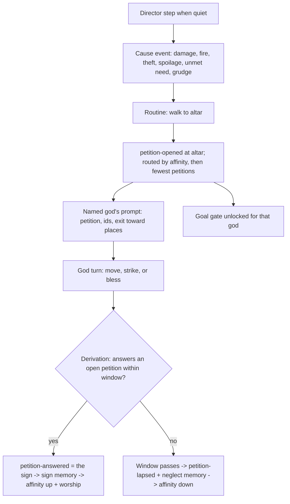

# feat: Petitions, answers, a quiet-world director, and goals that stick

## Overview

Mortals pray at the altar about losses the world recorded. The named god hears the prayer from anywhere and can answer it with a strike or a new bless action. The world judges whether the answer counts and sends the petitioner a sign. That sign changes the petitioner's affinity toward the god, and the petitioner worships. A quiet-world director causes trouble among mortals when nothing real has happened for a while. Goals stop churning: setting the same goal again does nothing, and a replacement is refused until the god has a reason to change. The experience gate then reruns on both models with petition checks.

## Problem Frame

Gate 2 failed on llama3.2 3B and Gemma 4. Goals and self-knowledge didn't break the Zeus↔Hera report loop. The world gives the gods nothing else to react to. They start alone together in a hall with no buildings and no mortals, mortal routines never come near them, and on Gemma the two spent every turn alone together. Goals were also brittle: the median goal lasted 1–2 of the god's own actions, and Gemma re-set the same goal every time. See origin: docs/brainstorms/2026-10-01-god-petitions-requirements.md.

## Requirements Trace

- R1–R8, petitions:
  - **Causes:** prayers come from recorded causes, and an unmet need becomes an event that stays open until the need is met.
  - **What a prayer asks:** one god and one request. A punishment is asked for only when the offender owns a building. Each cause leads to at most one petition.
  - **Which god:** the one with the highest affinity. Ties go to the god that has received fewer petitions.
  - **Who hears it:** the routine takes the mortal to the altar and back, and the named god hears the prayer from anywhere.
  - **In the god's prompt:** each petition with the places and ids the god may act on, plus the exit that leads toward each place.
- R9–R12, answers and worship:
  - **Valid answers:** a strike on a building the offender owns, or a bless on the petitioner, made within the window.
  - **Bless:** grants materials, and the mortal rebuilds the building itself.
  - **The sign:** raises the petitioner's favour and makes it worship. A lapse lowers favour.
  - **No obligation:** a petition never commits a god to answer.
- R13–R14, director: real, attributed trouble that is never undone. Gods learn of it only by petition or by seeing it themselves.
- R15–R17, goals that stick:
  - setting the same goal again does nothing;
  - a goal can only be replaced after N ticks, after news involving its target, after a new petition, or once it is achieved or failed;
  - a refused change is recorded and shown to the god.
- R18–R20, evidence: transcripts show all of the above. The gate checks that each god heard at least one petition and answered at least one, on both models.
- Success: every check passes on both models, and the owner rates no dimension 0 and decides to continue (see origin).

## Scope Boundaries

- No structured choice menus and no separate planning call. Those are the fallback if this gate fails.
- No restaging of the cast, no gods-first scheduler (M2 Unit 10), and no other five gods (M2 Unit 9).
- No free-text prayers.
- No omens, and nothing a god simply knows.
- No UI: signs and petitions are world events, visible through transcripts and inspection.

## Context & Research

### Relevant Code and Patterns

- Routines: `packages/world/src/routines.ts`. `decideRoutineProposal` scores candidates by drive utility and returns one proposal. A missing seller currently yields no candidate and records nothing, which is where unmet needs get detected.
- PRNG: `packages/world/src/state.ts`, persisted atomically with events in `packages/persistence/src/store.ts`.
- Worship: `packages/world/src/worship.ts`. `worship-performed` credits the deity's divinity and grants a temporary gather favour. No per-god favour score exists today.
- Relationships: `packages/world/src/memory.ts` `planRelationships` derives affinity and grudge from remembered harm or kindness.
- Damage, fire, repair:
  - `packages/world/src/validate.ts` (`handleStrike`, repair);
  - `packages/world/src/fire.ts` (environmental fire step using the PRNG);
  - `packages/world/src/repair.ts` (repair consumes planks).
- Environmental tick steps: income and fire in `packages/world/src/actions.ts` `runTick` belong to no proposal. The director joins them.
- Director source: `packages/contracts/src/proposal.ts` already reserves the proposal source `director`.
- Goals: `packages/world/src/goals.ts` `planGoalEvents` ends or replaces goals with no gate. The tick commits goal events whatever the action's outcome.
- Prompt and offers:
  - `packages/agents/src/context.ts`: `buildGodContext`, `rememberedBy` with its goal-history logic, and the per-action target enums in `godIntentSchema`;
  - `packages/agents/src/observation.ts`;
  - `apps/simulation/src/agents.ts` (`readOwnEvents`, the pattern for per-god committed reads inside the handled turn path).
- Map: `packages/world/src/geography.ts` has `outgoingEdges` and `findEdge` but no route search. `content/greek/world/locations.json` puts the altar off the town square.
- Content:
  - `content/greek/world/buildings.json`: the farmer owns the shop and the tavern, and the woodcutter owns nothing;
  - `content/greek/world/rules.json`: worship and favour tunables;
  - `packages/contracts/src/content.ts` for the strict rule parsers.
- Gate harness: `tools/scenarios/m2-greek-cast/src/episode-analysis.ts` and `transcript.ts`.
- Tests to mirror: `packages/world/src/goals.test.ts`, `memory.test.ts`, `validate.test.ts`, `routines.test.ts`, `fire.test.ts`, `packages/agents/src/goals-context.test.ts`, and the harness tests.

### Institutional Learnings

- `docs/solutions/logic-errors/knowledge-leaks-through-perception-timing-and-citations-2026-09-29.md`: a divine sense is a modelled channel judged when the event happens, and a sign carries no knowledge beyond itself.
- `docs/solutions/best-practices/side-effects-inside-the-commit-transaction-2026-09-28.md`: petition, answer, sign and favour events commit atomically with their tick.
- `docs/solutions/integration-issues/world-persistence-composition-broken-after-reopen-2026-09-27.md`: petition state rebuilds from the log, and decode validates.
- `docs/solutions/best-practices/catch-up-cap-per-backlog-not-per-run-2026-09-28.md`: windows and lapses come from simulation ticks, never wall time, and replay identically.
- `docs/solutions/logic-errors/tick-admission-starved-external-proposals-2026-09-28.md`: praying shares each actor's one slot per tick, so it must not starve production.
- `docs/solutions/logic-errors/accepted-memory-tunable-made-world-unreloadable-2026-09-29.md`: every new tunable gets a strict parser.
- `docs/solutions/best-practices/end-to-end-scenario-with-positive-controls-2026-09-28.md`: petition privacy needs a control that can fail.
- `docs/solutions/best-practices/greenfield-anti-over-engineering-2026-09-27.md`: build the direct version.

### External References

- Gate 2 measurements and external research on small-model planning, summarized in the origin document's Problem Frame and Sources.

## Prior-Art Survey

```json
{
  "schema_version": 2,
  "verdict": "extend",
  "scope": "packages/, apps/, tools/",
  "freshness": {
    "vcs_reference": "baea0ac06a057af2465834475545c066f01eea5d"
  },
  "budget": {
    "max_search_passes": 3,
    "max_candidate_inspections": 12,
    "exhausted": false
  },
  "candidates": [
    {
      "path_or_symbol": "packages/contracts/src/event.ts",
      "description": "append-only WorldEvent contracts, eventSubjects/eventCause/causalChain; owns committed facts and causal provenance for judged fulfilment",
      "disposition": "extend"
    },
    {
      "path_or_symbol": "packages/world/src/routines.ts",
      "description": "routine-driven mortal candidate selection; owns NPC-originated one-proposal-per-tick behavior and silent unmet-need gaps",
      "disposition": "extend"
    },
    {
      "path_or_symbol": "packages/agents/src/context.ts",
      "description": "god prompt construction, remembered state, own actions, goal history, offered actions, and ids the model may name",
      "disposition": "extend"
    },
    {
      "path_or_symbol": "apps/simulation/src/agents.ts:readOwnEvents/createGodTurnRunner",
      "description": "committed event reads feeding god turns regardless of current visible frame; owns durable prompt-side event retrieval pattern",
      "disposition": "extend"
    },
    {
      "path_or_symbol": "packages/world/src/perception.ts",
      "description": "co-location perception with an explicit perceivedLocations seam for future divine sensing powers",
      "disposition": "extend"
    },
    {
      "path_or_symbol": "packages/world/src/goals.ts",
      "description": "private active goal state and goal-set/goal-ended planning with target and sequence",
      "disposition": "extend"
    },
    {
      "path_or_symbol": "packages/world/src/worship.ts",
      "description": "worship-performed application, deity divinity credit, and temporary favor effect granted to the worshiper",
      "disposition": "extend"
    },
    {
      "path_or_symbol": "packages/world/src/memory.ts:planRelationships",
      "description": "relationship changes derived from remembered harm/kindness; closest existing reputation-score mechanism",
      "disposition": "extend"
    },
    {
      "path_or_symbol": "packages/contracts/src/proposal.ts",
      "description": "proposal sources include routine, model, and director; source controls trusted producer attribution",
      "disposition": "extend"
    },
    {
      "path_or_symbol": "tools/scenarios/m2-greek-cast/src/episode-analysis.ts",
      "description": "experience-gate automated checks per god over committed proposals, requests, and events",
      "disposition": "extend"
    },
    {
      "path_or_symbol": "tools/scenarios/m2-greek-cast/src/transcript.ts",
      "description": "episode transcript rendering for actions, caused events, checks, and owner rubric",
      "disposition": "extend"
    },
    {
      "path_or_symbol": "docs/plans/2026-09-29-001-feat-m2-autonomous-greek-cast-plan.md#Unit-12",
      "description": "planned quiet-world director with persisted PRNG, quietness by consequential events, and no automatic undo",
      "disposition": "extend"
    }
  ],
  "excluded_scopes": []
}
```

## Key Technical Decisions

- **Favour is the mortal's existing affinity toward the god.** There is no new score. A sign becomes a memory of a kindness by the god toward the petitioner, and a lapse becomes a memory of harm by the god's neglect. Both flow through `planRelationships` like any other memory. "Favours most" means highest affinity. As a side effect, a god's reports and legends can move favour too, since they already move affinity.
- **Petitions are world state rebuilt from events**, the same pattern goals use. Each petition records its petitioner, its god, its request, its cause event, its offender and the offender's buildings, the tick it opened, and its status (open, answered, or lapsed).
- **Praying commits a petition event placed at the altar.** Anyone at the altar witnesses the prayer. The named god receives it through the divine sense: its prompt reads open petitions addressed to it from world state, inside the handled turn path. No other god's prompt ever lists them.
- **Answers are judged during derivation, in the tick of the answering action.** Only the named god's committed strike on an operational building the offender owns counts, or its committed bless on the petitioner. The window is inclusive: an action counts if its tick is at most the open tick plus the answer window. A strike answers every open punish petition against that offender's building. A bless names the one petition it answers. `petition-answered` is the sign: a recorded, private divine act addressed to the petitioner. The petitioner's sign memory, its worship and its affinity change all derive from that event in the same tick. A dead petitioner's petition is marked answered, but no sign is sent and nothing derives from it.
- **Lapse runs in derivation, right after answer judging.** On the first tick after the window, a petition still open once that tick's answers are judged lapses. An answer in the same tick therefore always wins. The world never cancels a petition early because a target died or burned.
- **Tick order.** Primary events come first, then the environmental steps: income, fire, the unmet-need scan, and the director. Derivation follows: answer judging, then lapses, then memories (sign and lapse memories included), then relationship changes.
- **Unmet needs are found by an environmental scan, not by the routine's proposal.** Each tick, a pure function shared with the routine's need logic checks every living mortal. It records one `unmet-need` event per mortal per resource or trade it needs but can't get: no seller, an empty larder, no willing trader. Recording takes no action slot, and routines keep returning one proposal. The need stays open until it is met. Praying about it doesn't close it, but it can't produce a second petition.
- **Prayer is a routine candidate.** It ranks below repair and production and above idle gathering, and it is capped by a per-mortal cooldown. A mortal with a prayable cause walks to the altar one step per tick, prays, then returns to its home location. A cause stays prayable for a tunable number of ticks after it happened.
- **A mortal prays only about what it knows (W04).** A cause is prayable only through one of these:
  - **A memory:** the mortal holds a memory of the cause event, witnessed or told, and the memory's subjects name the offender.
  - **Its own unmet need:** a mortal always knows its own needs.
  - **What it now sees:** its own building damaged or burned, or its own stock gone, perceived where it stands. A loss discovered this way has no known offender.

  A punish petition needs a known offender, which only a memory supplies. Otherwise the petition asks for help. The global event log is never the mortal's knowledge.
- **Routing:** the god with the highest affinity. On a tie, the god that has received the fewest petitions worldwide, then by id order.
- **Bless mirrors strike and names a petition.** The god must be a deity with enough divinity and stand with the petitioner. The bless commits the divinity it consumes, plus a grant for that petition's cause:
  - planks for a damaged building it cites;
  - the needed resource for an unmet need;
  - the lost resource and amount for spoiled stock or theft, up to a tunable cap.

  A grudge never yields a help petition. If the offender owns no building, a grudge yields no petition at all. The mortal's repair routine repairs a building it was granted planks for before any other, and the damage history stays.
- **The director is an environmental step in the world tick, beside income and fire**, using the persisted PRNG. The quiet timer is ticks since the last consequential event. Consequential means a strike, theft, fire, trade, bless, answered petition, or the director's own trouble. God talk, prayers, and goals don't count. Because the director's own trouble resets the timer, the quiet window is also its only rate limit. When the timer passes the quiet window, the director picks a trouble type and its victims from eligible living mortals in id order. The choices are theft between two mortals, a fire in a storehouse, or spoiled stock. The event records the director as its cause. If too few mortals are eligible, the director skips that tick.
- **Theft and spoilage are new event kinds.** Theft moves goods from victim to offender and names the offender. Spoilage removes stock. Each is a prayable cause.
- **Goals are gated in `planGoalEvents`:**
  - A set with the same target and normalized text as the active goal is a no-op, and records nothing.
  - Ending a goal as achieved or failed is always allowed.
  - Replacing or abandoning a goal requires one of three things: the goal lock (ticks since the goal was set, counted from its set, not from any refusal) has passed; since the set, a memory has been recorded for the god whose subjects include the target; or since the set, the god has received a new petition.
  - Any other change records a private `goal-change-refused` event with its reason, and the next prompt shows it.
- **Route hints come from a new next-hop helper in `geography.ts`.** It runs a breadth-first search over edges the god can use, and the prompt names the exit to take toward each place a petition mentions. This is map knowledge only.
- **The woodcutter gets a woodshed** in content, so a theft by the woodcutter can be punished.
- **New tunables in `rules.json`, all strictly parsed:**
  - answer window, cause-prayable ticks, prayer cooldown;
  - bless divinity cost and grant amounts;
  - director quiet window;
  - goal lock ticks.

  Their starting values are recorded in `docs/product/defaults.md`.
- **Greenfield.** No migrations. If the schema changes, bump the store schema version (memory #8478).

## Open Questions

### Resolved During Planning

- Petition routing on ties: the god with the fewest petitions worldwide, then id order.
- Sign timing: the same tick as the answer.
- Answer and lapse in the same tick: the answer wins.
- Strike on an already-burning building: not an answer, because `handleStrike` already rejects it.
- Which god's petitions unlock a goal change: only the addressed god's.
- **The answer window comes from the map and the slowest measured god pace.** The longest route from the great hall to a petition target (great hall, Olympus gate, mountain path, town square, then the target building's place) is 4 moves, plus 1 answering action. Gate 2's slowest god committed 12 actions in 300 ticks, about one action per 25 ticks. The window is therefore at least twice 5 × 25, which is 250 ticks. A unit test checks the window against the map's route length at that pace, so any change to the content or the tunable is caught.
- Whether director trouble resets the quiet timer: yes, so it fires at most once per quiet window and needs no separate cooldown.

### Deferred to Implementation

- **The other tunables' starting values** (bless cost and grants, cause-prayable ticks, prayer cooldown, goal lock, quiet window). Set them before the smoke run and adjust from it.
- **How sign and lapse memories are represented.** Either a new memory kind or a told memory with the god as its source. Settle this when touching `memory.ts`. Either way, the affinity change goes through `planRelationships`.
- **Where the woodshed sits** and what it stores. Pick a location the woodcutter's routine already uses.
- **Whether the scripted `scenario:m2` story needs a new step**, or whether its existing steps simply gain petitions. Every change must trace back to the requirements.

## High-Level Technical Design

> *This illustrates the intended approach and is directional guidance for review, not implementation specification. The implementing agent should treat it as context, not code to reproduce.*



## Implementation Units

### Phase 1: Foundations

- [x] **Unit 1: Contracts, content, and tunables**

**Goal:** Define every new event and action, add the woodshed, and add the tunables with strict parsers.

**Requirements:** R1–R4, R9–R11, R13, R17

**Dependencies:** None

**Files:**
- Modify: `packages/contracts/src/event.ts`, `packages/contracts/src/proposal.ts`, `packages/contracts/src/content.ts`, `content/greek/world/buildings.json`, `content/greek/world/rules.json`
- Test: `packages/contracts/src/event.test.ts`, `packages/contracts/src/proposal.test.ts`, `packages/contracts/src/content.test.ts`

**Approach:**
- New events: `unmet-need`, `theft`, `stock-spoiled`, `petition-opened`, `petition-answered`, `petition-lapsed`, `goal-change-refused`. Director trouble carries the director as its cause.
- `petition-opened` is placed at the altar. `petition-answered`, `petition-lapsed` and `goal-change-refused` are private and unplaced.
- New proposals: a routine `pray` and a model `bless`.
- Add the strict tunable parsers listed in the Key Technical Decisions.

**Execution note:** Implement test-first.

**Patterns to follow:** existing event kinds, the unplaced kinds, `parseMemoryBalance`.

**Test scenarios:**
- Happy path: each new event and proposal parses and round-trips.
- Error path: reject a punish petition with no offender buildings, a petition naming no god, and a zero, negative or fractional tunable.
- Edge case: the private kinds are unplaced and excluded from witnessed kinds; `petition-opened` is placed.
- Happy path: the content pack loads with the woodcutter's woodshed.

**Verification:** the contract and content tests pass and the workspace type-checks.

- [x] **Unit 2: Unmet needs, theft and spoilage, and route search**

**Goal:** Turn silent routine failures into events, apply theft and spoilage, and find the next hop toward a place.

**Requirements:** R1–R2, R8, R13

**Dependencies:** Unit 1

**Files:**
- Modify: `packages/world/src/routines.ts`, `packages/world/src/actions.ts`, `packages/world/src/state.ts`, `packages/world/src/codec.ts`, `packages/world/src/geography.ts`
- Test: `packages/world/src/routines.test.ts`, `packages/world/src/geography.test.ts`, `packages/world/src/actions.test.ts`

**Approach:**
- An environmental scan, sharing the routine's need logic, records `unmet-need` once per open need and closes it when the need is met. Each mortal keeps its open unmet needs in world state.
- Reducers apply theft and spoilage.
- A next-hop search runs over usable edges.

**Execution note:** Implement test-first.

**Test scenarios:**
- Happy path: the farmer wants planks and no one sells them, so one `unmet-need` is recorded. On the next attempt nothing more is recorded, and buying planks closes the need.
- Happy path: theft moves goods to the offender, and spoilage removes stock.
- Happy path: the next hop from the great hall toward the town square is the Olympus gate.
- Edge case: an unreachable place has no hop.
- Integration: replaying from the log reproduces the open needs.

**Verification:** world tests pass and scripted `scenario:m1` still passes.

### Phase 2: Petitions

- [x] **Unit 3: Praying and petition state**

**Goal:** Mortals walk to the altar, pray, and open routed petitions.

**Requirements:** R1, R3–R6

**Dependencies:** Unit 2

**Files:**
- Create: `packages/world/src/petitions.ts`
- Modify: `packages/world/src/routines.ts`, `packages/world/src/validate.ts`, `packages/world/src/actions.ts`, `packages/world/src/state.ts`, `packages/world/src/codec.ts`
- Test: `packages/world/src/petitions.test.ts`, `packages/world/src/routines.test.ts`

**Approach:**
- The prayer candidate follows the rule in the Key Technical Decisions, then the mortal returns home.
- The validator opens the petition and routes it. It also chooses punishment or help, using punishment only when the offender owns a building.
- One petition per cause.

**Execution note:** Implement test-first.

**Test scenarios:**
- Happy path: the farmer's tavern burns. The farmer walks to the altar over several ticks, prays to the god it has the higher affinity toward, and walks home.
- Happy path: on an affinity tie, the god with fewer petitions worldwide gets the prayer. On a full tie, id order decides.
- Edge case: a theft by the woodcutter asks for punishment, naming the woodshed. A theft by an offender with no buildings asks for help.
- Edge case: the same cause never opens a second petition, and the cooldown stops prayers on back-to-back ticks.
- Edge case: a cause older than the prayable window is not prayed about.
- Integration: production still runs. A mortal with work prefers repair and production over prayer.
- Edge case: anyone at the altar witnesses `petition-opened`. Only the named god's state lists it as heard.

**Verification:** world tests pass and the economy tests are unchanged.

- [x] **Unit 4: Bless, answer judging, signs, and lapses**

**Goal:** Gods can bless. The world judges answers, sends signs, and lapses petitions that go unanswered.

**Requirements:** R9–R12

**Dependencies:** Unit 3

**Files:**
- Modify: `packages/world/src/validate.ts`, `packages/world/src/actions.ts`, `packages/world/src/petitions.ts`, `packages/world/src/memory.ts`, `packages/world/src/worship.ts`
- Test: `packages/world/src/petitions.test.ts`, `packages/world/src/validate.test.ts`, `packages/world/src/memory.test.ts`

**Approach:**
- Bless works like strike: it names a petition, checks the god's cost and that the god is standing with the petitioner, then grants that petition's need. The repair routine prefers a building it was granted planks for.
- Derivation judges answers and emits `petition-answered`, which is the sign. From it come the sign memory, the worship event and the affinity change.
- Lapses run in derivation, right after answer judging, following the tick order in the Key Technical Decisions.

**Execution note:** Implement test-first.

**Test scenarios:**
- Happy path (origin AE2): Zeus strikes the woodcutter's woodshed within the window, so the petition is answered. The farmer gets a sign, its affinity toward Zeus rises, and it worships Zeus, crediting his divinity.
- Happy path (origin AE3): Hera blesses the farmer, and the farmer gets planks while its storehouse stays damaged. The farmer's repair routine then repairs it, and the damage stays in the log.
- Edge case: a strike by the other god does not answer.
- Edge case: a strike on a building not owned by the offender does not answer.
- Edge case: an action on the last tick of the window answers, and one on the next tick doesn't.
- Edge case: with two open help petitions from the farmer, a bless naming one answers only that one and grants only its need.
- Integration: the farmer owns two damaged buildings, and Hera's bless cites the storehouse. The farmer's repair routine spends the granted planks on the storehouse first.
- Error path: bless is refused when the god isn't standing with the mortal or lacks the divinity.
- Edge case (origin AE4): the window closes unanswered, so the petition lapses and the petitioner's affinity toward that god falls.
- Edge case: an answering action on the first tick after the window still loses, because the window is inclusive. An answering action on the window's last tick, in the same tick the lapse check runs, resolves as answered.
- Integration: the farmer's unmet need is recorded while the farmer's routine still trades or gathers that tick.
- Edge case: a dead petitioner's petition is marked answered and no sign is sent.
- Edge case: the sign gives the petitioner no knowledge of where or how the god answered.
- Integration: archive rebuild reproduces petitions, answers, lapses and affinity.

**Verification:** world tests pass and the archive rebuild-and-compare test passes.

### Phase 3: Director and goals

- [x] **Unit 5: Quiet-world director**

**Goal:** When nothing real happens for the quiet window, the director causes attributed trouble among mortals.

**Requirements:** R13–R14

**Dependencies:** Units 2 and 3

**Files:**
- Create: `packages/world/src/director.ts`
- Modify: `packages/world/src/actions.ts`, `packages/world/src/state.ts`, `packages/world/src/codec.ts`
- Test: `packages/world/src/director.test.ts`

**Approach:**
- The director is an environmental step that uses the persisted PRNG and the last consequential tick.

**Execution note:** Implement test-first.

**Test scenarios:**
- Happy path (origin AE5): after the quiet window, the director makes the woodcutter rob the farmer, with the theft attributed to the director. The farmer later prays about it.
- Edge case: god reports, legends, goals and prayers don't reset the timer. A trade, strike, fire, bless, answered petition, or the director's own trouble does, so two director troubles are at least one quiet window apart.
- Edge case: with too few eligible mortals, the director skips that tick.
- Edge case: the director never undoes damage.
- Integration: the same seed and log replay the same director events.
- Edge case: director trouble at the town square isn't in a god's prompt unless the god perceives it or hears a petition about it.

**Verification:** world tests pass.

- [x] **Unit 6: Goals that stick**

**Goal:** Gate goal changes and record refusals.

**Requirements:** R15–R17

**Dependencies:** Unit 3

**Files:**
- Modify: `packages/world/src/goals.ts`, `packages/world/src/actions.ts`, `packages/world/src/state.ts`
- Test: `packages/world/src/goals.test.ts`

**Approach:** Apply the gate exactly as stated in the Key Technical Decisions. Record the tick each goal was set on the active goal.

**Execution note:** Implement test-first.

**Test scenarios:**
- Happy path (origin AE6): setting the same goal again records nothing.
- Edge case: text that differs only by case and spacing counts as the same goal.
- Happy path (origin AE7): a replacement two ticks after the set, with no news, is refused and records `goal-change-refused`. After the god hears a petition, the replacement is allowed.
- Happy path: once the goal lock passes, a replacement is allowed.
- Happy path: a memory whose subjects include the target unlocks a replacement.
- Edge case: ending a goal as achieved or failed is allowed at any time. Abandoning one is gated.
- Edge case: a petition addressed to the other god doesn't unlock this god's goal.
- Integration: a refused change on a rejected action still records the refusal, and the journal entry is consumed once.

**Verification:** goal tests pass and the #75 goal tests still pass.

### Phase 4: Prompt, evidence, and gate

- [x] **Unit 7: God prompt and intent**

**Goal:** A god sees its petitions, the way toward them, its bless option, and why a goal change was refused.

**Requirements:** R6–R8, R10, R17

**Dependencies:** Units 4–6

**Files:**
- Modify: `packages/agents/src/context.ts`, `packages/agents/src/observation.ts`, `packages/agents/src/turn.ts`, `apps/simulation/src/agents.ts`
- Test: `packages/agents/src/petitions-context.test.ts` (new), `packages/agents/src/goals-context.test.ts`, `apps/simulation/src/agents.test.ts`

**Approach:**
- A "Prayers to you" section lists the open petitions addressed to this god. Each shows who asked, the request, the cause, where the petitioner is, the offender and its buildings, and the exit toward each place.
- Bless is offered for petitioners who are present.
- Replace the line "A new goal ends your old one" with the gate rule, and show the god's latest refusal and its reason.
- Petitions are read inside the handled turn path.

**Execution note:** Implement test-first.

**Test scenarios:**
- Happy path: Hera on Olympus with the farmer's punish petition sees the farmer, the woodcutter, the woodshed, and "take the Gates of Olympus toward the town square".
- Edge case: Zeus's prompt never lists a petition addressed to Hera.
- Edge case: the woodshed becomes a strike target only once it is in the scene.
- Happy path: bless is offered when the farmer is present, naming one of the farmer's open help petitions, and not otherwise.
- Happy path: after a refusal, the next prompt says a goal change was refused and why.
- Integration: a store fault while reading petitions returns a handled failure.

**Verification:** agents tests pass. Measure prompt length for a god with three petitions against the 4K budget.

- [x] **Unit 8: Gate checks, transcripts, and petition privacy**

**Goal:** The gate checks that each god heard and answered at least one petition, proves petitions stay private, and renders the new events.

**Requirements:** R18–R20

**Dependencies:** Unit 7

**Files:**
- Modify: `tools/scenarios/m2-greek-cast/src/episode-analysis.ts`, `tools/scenarios/m2-greek-cast/src/transcript.ts`, `tools/scenarios/m2-greek-cast/src/real-analysis.ts`, and the scripted story under `tools/scenarios/m2-greek-cast/src/steps/` with a petition-privacy control
- Test: `tools/scenarios/m2-greek-cast/src/episode-analysis.test.ts`, `transcript.test.ts`, `real-analysis.test.ts`

**Approach:**
- Add two per-god checks: heard at least one petition, and answered at least one.
- Report goal lifetime and refusals.
- Add a real-run property: no god's prompt lists a petition addressed to another god.
- Add a scripted positive control that injects a petition into the wrong god's prompt and must exit 1.
- Transcripts show prayers, answers, signs, lapses, director events, unmet needs, and refused goal changes.

**Execution note:** Implement test-first. Each check needs a failing case and a passing control.

**Test scenarios:**
- Error path: a god that heard no petition fails the heard check.
- Error path: a god that heard a petition but answered none fails the answered check.
- Error path: the privacy property fails when a petition to Hera appears in Zeus's prompt.
- Happy path: a transcript shows the farmer's prayer, Zeus's strike answering it, the sign, and the affinity rise.
- Integration: the scripted privacy control exits 1.

**Verification:** harness tests pass, scripted `scenario:m2` passes, and a 60-second smoke run renders a real prayer.

- [x] **Unit 9: Docs**

**Goal:** Record the tunables and requirement evidence, and update the M2 plan.

**Requirements:** traceability rule (AGENTS.md)

**Dependencies:** Units 1–8

**Files:**
- Modify: `docs/product/defaults.md` (the new tunables, and the favour note: petition favour is affinity, which reports and legends already move through their claims), `docs/product/traceability.md` (W04, W05, W07, W08, W10, O04, O08), `docs/plans/2026-09-29-001-feat-m2-autonomous-greek-cast-plan.md` (gate section, and Unit 12 marked as covered by this plan's director)

**Test expectation:** none. This unit changes documents only.

**Verification:** `bun run check` passes and the docs match the behavior.

- [ ] **Unit 10: Rerun the gate**

**Goal:** Produce gate 3 evidence.

**Requirements:** R19–R20, Success Criteria

**Dependencies:** Units 1–9 merged

**Approach:** Run 3 fresh 5-minute episodes on `llama3.2-3b-4k` and 3 on `gemma4-e4b-4k` with reasoning off. The owner rates them and decides.

**Test expectation:** none. This is an evidence run.

**Verification:** every check passes on both models, and the owner's rating meets the bar. Otherwise, fall back to structured choice (see origin).

**Outcome (2026-10-01): gate 3 failed.** Both models failed "petition answered": 0 of 6 god-episodes on each, before and after the prompt tune (`20ae42b`: prayers first, a next-step line per prayer, repeated reports collapsed, goal changes riding with an action). Every petition was a help-with-food request, and no strike or bless was committed. llama3.2 3B failed repetition in 4 of 6 god-episodes before the tune and 1 of 6 after (longest run 4; 41 of episode 3's 43 exhausted requests were move versus realm-transition destination errors); gemma4:e4b failed repetition in 6 of 6 both times, with goals stalled. Evidence: `tools/scenarios/m2-greek-cast/episodes/2026-10-01T22-18-59/` (llama, before), `2026-10-01T22-34-02/` (gemma, before), `2026-10-01T23-05-12/` (llama, after), `2026-10-01T23-20-15/` (gemma, after). Next: try other local models, then decide on the structured-choice fallback. The unit stays open.

## System-Wide Impact

- **Interaction graph:** routine → pray → petition → god prompt → god turn → strike or bless → derivation (answer, sign, worship, affinity) → routing for later prayers. The director feeds causes into the same path.
- **State lifecycle:** petitions, open needs, the director's last consequential tick, and the goal-set tick are all world state rebuilt from the log. Archive import compares all of them.
- **Admission:** prayer uses the mortal's one slot per tick. Bless uses the god's action slot.
- **Unchanged invariants:**
  - The world is authoritative.
  - W04: the divine sense is the only new channel, and it covers only petitions addressed to that god.
  - Inference stays outside transactions.
  - Catch-up and replay call no model.
  - Fire, income, and repair rules are unchanged, except that blessed planks feed repair.

## Implementation Departures (2026-10-01)

Recorded as built, units 1–9:

- **Every event records the tick it happened in** (`EventEnvelope.tick`). Windows, cooldowns, and the goal lock count ticks, and a replay has to reproduce them, so the tick had to be on the event.
- **`need-met` event and `OpenNeed` state.** An unmet need needed a closing event, so the open need is world state keyed per mortal and resource, closed by `need-met`.
- **A `sign` memory kind and a `noticed` memory kind.** Sign and lapse memories are a memory kind with the god and the petition and a consequence (kindness or harm) that moves affinity. A `noticed` memory carries no consequence and no offender.
- **`blessResourceCap` tunable** for the lost-resource grant, and a help request for lost stock carries the amount lost.
- **A theft is witnessed** by whoever is where it happens (`salience_theft`), so a mortal who saw it can name the thief.
- **Income only for buildings that offer a service.** Otherwise the woodshed paid the woodcutter for doing nothing. This changes M1's economy and is recorded in `defaults.md` as a rule change.
- **The walk home is tied to the prayer trip:** a mortal walks home only within its prayer cooldown, so one placed elsewhere any other time stays put.
- **`loss-noticed` event** (W04 amendment, owner decision): the plan said a mortal prays about a loss it "perceives where it stands now", which cannot survive the walk to the altar without state. An environmental scan records a private `loss-noticed` once per owner and cause when an owner stands at its own damaged, burning, or destroyed building or owns stolen or spoiled stock, and derives a `noticed` memory with no offender, which keeps the cause prayable as a help petition.
- **One open petition per resource or building** (owner decision, after the first smoke showed food prayers flooding the gods' lists): a mortal does not pray about a resource or a building while its own earlier petition about the same one is still open. A new cause still counts as a new cause for R3 (one petition per cause); the rule only blocks praying while one is open, and an answer or a lapse frees the next cause.
- **Prompt caps:** the prayers section lists every open petition (R7); no cap hides one. Seven open petitions add about 2.3 thousand characters on the authored world.
- **`PANTHEA_PETITION_BALANCE`:** an environment override of the petition tunables, through the strict parser, so the scripted story can turn the director off without a code path of its own.

## Open Risks Found While Building

- **Unmet food needs flap** (addressed by the one-open-petition rule above). On the authored world the farmer and the woodcutter record an unmet food need every three to six ticks, each a new cause; the rule keeps each mortal to one open food petition at a time. Whether the gods' lists are still dominated by food prayers is for gate 3 to show.
- **The scripted story fixes a race by policy.** The farmer's own routine walks it to the altar, so S4 stages the strike with a reply that strikes once Zeus's prompt shows the farmer at the tavern.

## Risks & Dependencies

| Risk | Mitigation |
|------|------------|
| Petitions lapse before a god can travel | The window is derived from the route length and the slowest measured pace, and a test keeps them consistent |
| Mortals pray instead of working | Prayer ranks below production, with a cooldown |
| Gods still loop on each other | A new petition unlocks goal changes. The repetition cap stays a hard check. Structured choice is the next option |
| Affinity drowns in report and legend effects | Accepted. Favour reflects everything a mortal knows about a god |
| Prompt grows past budget | Every open petition is listed (R7). Few are open at once: one per cause, a prayer cooldown, and a closing window. Length is measured in Unit 7 |

## Sources & References

- **Origin document:** docs/brainstorms/2026-10-01-god-petitions-requirements.md
- Gate 2 evidence: `tools/scenarios/m2-greek-cast/episodes/2026-10-01T15-37-30/`, `tools/scenarios/m2-greek-cast/episodes/2026-10-01T15-52-36/`
- Prior replan: docs/plans/2026-10-01-001-feat-god-goals-plan.md
- M2 plan Unit 12: docs/plans/2026-09-29-001-feat-m2-autonomous-greek-cast-plan.md
- Requirements: W04, W05, W07, W08, W10, O04, O08 in docs/product/requirements.md. Decisions D08 and D10 in docs/product/decisions.md.
