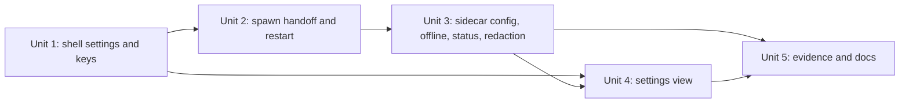

# feat: provider settings, endpoint keys in the Keychain, and an offline switch

## Overview

This plan refines Unit 3 of `docs/plans/2026-09-29-001-feat-m2-autonomous-greek-cast-plan.md` into buildable units. The operator lists model endpoints, assigns them to roles with an ordered fallback, stores an endpoint's key, and switches offline mode, all from a settings view in the desktop app. Today routing comes from a JSON file named by `PANTHEA_MODEL_CONFIG`, and no key path exists.

## Problem Frame

Gods only take turns when a developer points `PANTHEA_MODEL_CONFIG` at a file. The packaged app has no way to choose a model, store a key, or go offline. ADR-0005 (`docs/decisions/0005-model-providers.md`) already fixes the design: endpoints are peers, fallback is an operator-ordered list, offline mode drops non-local endpoints before any adapter is built, and the key lives only in platform credential storage, read by the shell at sidecar spawn and passed with the launch token. Unit 3 must also land before M2's exit gate (Unit 13).

## Requirements Trace

- P06: guided model setup and configurable role assignments (settings view, role assignment; first-run model download stays deferred).
- P07: optional hosted and mixed inference with fallback; no network fallback in offline mode.
- AGENTS.md credential invariant: no credential-bearing data in content, saves, prompts, telemetry, or logs; credentials live only in platform credential storage.
- AGENTS.md offline invariant: offline mode never silently falls back to a hosted provider.

## Scope Boundaries

- macOS Keychain only, through the `keyring` crate (owner choice, 2026-10-01). Windows uses the same crate later as configuration, not a rewrite.
- No extra hosted-provider hardening: no separate credential window, key rotation, or core-dump limits (owner decision 2026-09-29).
- No first-run model download or Ollama management.
- No migration of `PANTHEA_MODEL_CONFIG` files: the source is removed, not shimmed.

## Context & Research

### Relevant Code and Patterns

- `packages/agents/src/config.ts`: `Endpoint {id, baseUrl, model, keyRef?, reasoningEffort?}`, role assignments, fallback, parser that rejects `local`, URL credentials, and unknown keys; `planRoute` derives locality from the URL and filters offline.
- `packages/agents/src/router.ts`: reads a key lazily through `getKey(keyRef)` only for an endpoint that survives the offline filter; failure details already redact an echoed key (`router.test.ts`).
- `apps/simulation/src/model-config.ts` and `index.ts` (~247–254): env-file source; router built with `offline: false` and no `getKey`.
- `apps/desktop/src-tauri/src/sidecar.rs`: random launch token written to stdin, never argv, env, or logs; `apps/simulation/src/index.ts` (~402–419) reads it.
- `apps/desktop/src-tauri/src/state.rs`: one-lock lifecycle with stop, restart, and launch fencing.
- `apps/desktop/src-tauri/src/lib.rs`, `commands.rs`, `capabilities/proxy.json`: two commands today; the proxy capability grants only those.
- `apps/client/src/connection.ts`: `Transport` seam over `invoke`; `apps/client/src/ui/surface.tsx`: the only view, with status banners (`model-degraded` reads "Models unavailable — world running").

### Institutional Learnings

- `docs/solutions/best-practices/lifecycle-state-one-lock-transitions-2026-09-28.md`: restarts go through the state machine with a new launch id; effects run after unlock.
- `docs/solutions/best-practices/end-to-end-scenario-with-positive-controls-2026-09-28.md`: every "never leaks" or "never sends" claim needs a positive control that fails the run.
- `docs/solutions/integration-issues/koota-new-function-tauri-csp-2026-09-27.md`: verify UI in the packaged `.app`; the dev server hides CSP failures.
- ADR-0003 (stdin launch token, orphan guards), ADR-0006 (redact at the trace write boundary before a credential-bearing producer exists).

### External References

- `keyring` 4.2.0 (https://docs.rs/crate/keyring/4.2.0): `Entry::new(service, user)`, `set_password`, `get_password`, `delete_credential`; default features include the Apple Keychain backend; `NoEntry` for absent items, `NoStorageAccess`/`PlatformFailure` for denied or locked; the error enum is non-exhaustive. The mock store is process-global.
- Unsigned or ad-hoc dev builds can trigger Keychain access prompts after each rebuild; a signed packaged app keeps trust (Apple TN2206; tauri-apps/tauri#8662).

## Prior-Art Survey

```json
{
  "schema_version": 2,
  "verdict": "extend",
  "scope": "apps/desktop/src-tauri, apps/simulation, packages/agents, apps/client/src, packages/telemetry, docs",
  "freshness": { "vcs_reference": "ba4b6cd main" },
  "budget": { "max_search_passes": 3, "max_candidate_inspections": 10, "exhausted": false },
  "candidates": [
    { "path_or_symbol": "packages/agents/src/config.ts", "description": "endpoint, role, and fallback config; URL-derived locality; keyRef-only metadata", "disposition": "extend" },
    { "path_or_symbol": "packages/agents/src/router.ts", "description": "OpenAI-compatible routing with lazy getKey and redacted failures", "disposition": "extend" },
    { "path_or_symbol": "apps/simulation/src/model-config.ts", "description": "env-pointed routing file source", "disposition": "insufficient", "insufficiency_reason": "developer-only file source; settings must be shell-owned and arrive with keys at spawn" },
    { "path_or_symbol": "apps/desktop/src-tauri/src/sidecar.rs", "description": "spawn supervision and stdin launch-token channel", "disposition": "extend" },
    { "path_or_symbol": "apps/client/src/ui/surface.tsx", "description": "designer-owned surface and status patterns", "disposition": "extend" },
    { "path_or_symbol": "Keychain code", "description": "none exists", "disposition": "insufficient", "insufficiency_reason": "new Rust helper and dependency needed" }
  ]
}
```

## Key Technical Decisions

- **The shell owns settings and keys; the sidecar receives both at spawn.** Settings persist as `model-settings.json` in the app data directory, outside world saves and exports, and contain `keyRef`s, never keys. One source for the packaged app and the harnesses: `PANTHEA_MODEL_CONFIG` is removed.
- **Spawn handoff on stdin.** The token line is followed by one JSON line `{models, offline, keys}`. `keys` holds only the keys whose `keyRef` the config references. The sidecar keeps keys in memory and serves them through the router's `getKey`. Never argv or env (ADR-0003). Stdin stays open after both lines: its EOF is still the orphan guard and shutdown signal (`apps/simulation/src/lifecycle.ts`).
- **Any settings change restarts the sidecar** through a new lifecycle transition, apply-restart: under the lock it takes the running child, aborts polling, bumps the launch id, and resets frame state; after unlock it kills the old child and spawns the new one. The existing restart only runs from stopped or exhausted and does not kill a live child (`state.rs`, `sidecar.rs`). One apply path for config, key, and offline changes; catch-up covers the gap.
- **Validation lives in one place.** The client validates with the existing config parser, reached through a browser-safe `@panthea/agents/config` subpath export (the package root also exports router and provider code); the shell stores the JSON verbatim (size-capped); the sidecar parses again at start. An invalid file, which only a hand edit can produce, starts the world with god turns off under the existing `model-degraded` reason and logs the parse error, instead of failing startup, so it can't crash-loop the sidecar. No new degraded reason, so the frame contract is unchanged.
- **Keys are write-only from the UI.** Commands: save settings, read settings, set key, delete key, and key status (set or missing per `keyRef`, never values). Only the shell's spawn path calls `get_password`.
- **Keychain behind a small trait.** Production uses `keyring`; tests use an in-memory store injected per test, avoiding the crate's process-global mock.
- **Endpoint status comes from real requests.** The sidecar reports each endpoint's last outcome (ok, failed with a redacted reason, or not yet tried) from the router; the settings view shows it. No separate probe.
- **Redaction at the trace write boundary (ADR-0006).** The trace writer replaces any loaded key value with a marker before a row is stored. Endpoint requests are the first credential-bearing producer.

## Open Questions

### Resolved During Planning

- Keychain scope and crate: macOS only, `keyring` (owner, 2026-10-01).
- Config apply: restart on every change, not hot reload.
- Source of truth for validation: the existing TypeScript parser.

### Deferred to Implementation

- Exact Keychain service and account naming (one service, account = `keyRef`).
- Whether the harnesses write `model-settings.json` into their temp app data dir or send the stdin line directly; either keeps one code path in the sidecar.
- Shape of the endpoint-status payload (frame field or its own route), once the router hook is in place.

## Implementation Units



- [x] **Unit 1: Shell settings store and Keychain commands**

**Goal:** the shell persists non-secret settings and stores endpoint keys in the Keychain behind write-only commands.

**Requirements:** P06, P07, credential invariant

**Dependencies:** none. Adding `keyring` changes `Cargo.lock`; the owner approves before it lands.

**Files:**
- Create: `apps/desktop/src-tauri/src/settings.rs`, `apps/desktop/src-tauri/src/keys.rs`
- Modify: `apps/desktop/src-tauri/src/commands.rs`, `lib.rs`, `capabilities/proxy.json`, `Cargo.toml`, `Cargo.lock`
- Test: Rust unit tests beside each module

**Approach:**
- `settings.rs` reads and writes `model-settings.json` atomically (write then rename) with a size cap.
- `keys.rs` defines a key-store trait (set, get, delete, status); the `keyring` implementation maps `NoEntry` to missing and access or locked failures to an error the UI can show, never including the value.
- New commands are added to the proxy capability only.

**Execution note:** test-first.

**Patterns to follow:** `sidecar.rs` token handling (never logged); `commands.rs` registration.

**Test scenarios:**
- Happy path: save then read settings returns the same JSON; set key then status reports set; delete then status reports missing.
- Edge case: oversized settings rejected; missing file reads as no settings.
- Error path: a store that fails on set reports an error without the key text.
- Integration: no command returns a key value (status only).

**Verification:** cargo tests pass; `cargo fmt --check` and `cargo clippy -- -D warnings` clean.

- [x] **Unit 2: Spawn handoff and restart on change**

**Goal:** the sidecar starts with settings, offline flag, and the referenced keys over stdin; any settings change restarts it.

**Requirements:** P06, P07, credential invariant

**Dependencies:** Unit 1

**Files:**
- Modify: `apps/desktop/src-tauri/src/sidecar.rs`, `state.rs`, `commands.rs`
- Modify: `apps/simulation/src/index.ts`, `apps/simulation/src/lifecycle.ts` (read token and config lines, keep EOF shutdown); delete `apps/simulation/src/model-config.ts` and its test
- Modify: `apps/simulation/src/agents.test.ts` (its service spawn helper sets `PANTHEA_MODEL_CONFIG`; send the config line instead)
- Modify: `tools/scenarios/m1-living-world/src/sidecar.ts`, `tools/scenarios/m2-greek-cast/src/real.ts`, `story.ts`, `report.ts`, `steps/s01-idle.ts`
- Test: `sidecar.rs` and `state.rs` tests; `apps/simulation/src/index.test.ts`; scenario harness tests

**Approach:**
- After the token line the shell writes `{models, offline, keys}` and keeps stdin open; keys are read from the store only at spawn.
- Save, set-key, delete-key, and offline toggle go through the apply-restart transition (see Key Technical Decisions).
- Harnesses send the same line; `PANTHEA_MODEL_CONFIG` disappears.

**Execution note:** test-first.

**Patterns to follow:** `docs/solutions/best-practices/lifecycle-state-one-lock-transitions-2026-09-28.md`.

**Test scenarios:**
- Happy path: a spawn with a config line starts god turns on the assigned endpoint.
- Happy path: changing a key restarts the sidecar with a new launch id, and the new key reaches it.
- Edge case: no settings means no god turns, world runs.
- Error path: an invalid config line starts the world with god turns off under `model-degraded`, and the log names the parse error.
- Edge case: stdin EOF after both lines still shuts the sidecar down.
- Integration: apply-restart while running kills the old child; concurrent Stop and settings-save never leave two sidecars or none.

**Verification:** `bun run check`; cargo checks; scripted `scenario:m1` and `scenario:m2` stay OK.

- [x] **Unit 3: Sidecar offline mode, keys, endpoint status, and trace redaction**

**Goal:** the router gets the operator's offline flag and keys; the sidecar reports per-endpoint outcomes; no key reaches prompts, traces, the journal, or logs.

**Requirements:** P07, credential invariant, offline invariant

**Dependencies:** Unit 2

**Files:**
- Modify: `apps/simulation/src/index.ts`, `server.ts`; `packages/agents/src/router.ts`; `packages/telemetry/src/trace.ts`; `packages/contracts/src/snapshot.ts` if status rides the frame
- Test: `packages/agents/src/router.test.ts`, `packages/telemetry/src/trace.test.ts`, `apps/simulation/src/model-degraded.test.ts`, a new sentinel test in `apps/simulation/src/`

**Approach:**
- `createRouter` receives `offline` and `getKey` from the spawn line.
- The router records each endpoint's last outcome with a redacted reason; the sidecar exposes it.
- The trace writer replaces loaded key values before storing a row.

**Execution note:** test-first; every negative test has a positive control.

**Test scenarios:**
- Happy path: online, a role on a keyed endpoint sends the bearer key (positive control).
- Offline: a hosted endpoint is dropped, its key is never read, and a local fallback answers.
- Offline positive control: the same config online does reach the hosted endpoint.
- Sentinel: a planted key sent through the spawn line and a scripted provider never appears in prompts, trace rows, the journal, or sidecar logs; a control that deliberately echoes it into a trace row is redacted, and one that bypasses the writer fails the check.
- Status: an unreachable endpoint reports failed with a reason, gods idle with `model-degraded`, and recovery reports ok.

**Verification:** `bun run check`.

- [x] **Unit 4: Settings view**

**Goal:** the operator edits endpoints, roles, fallback order, keys, and offline mode in the desktop app.

**Requirements:** P06, P07

**Dependencies:** Unit 1 for commands; Unit 3 for endpoint status

**Files:**
- Create: settings view under `apps/client/src/ui/`
- Modify: `apps/client/src/connection.ts` (transport for the new commands), `apps/client/src/ui/surface.tsx` (entry point), `apps/client/package.json` (depend on `@panthea/agents`)
- Modify: `packages/agents/package.json` (add the `./config` subpath export of the parser only)
- Test: view tests beside it

**Approach:**
- @designer owns layout, interaction, and wording.
- States: endpoint reachable, failed, or untried; a role with no endpoint or an unknown model; key saved or missing; offline on with hosted endpoints shown as dropped; "saving restarts the world service".
- Accessibility: semantic form controls, visible focus and keyboard order, announced save and error states, no colour-only state, usable at 1280×720 with larger text.
- Validation uses the `packages/agents` parser before save.

**Test scenarios:**
- Happy path: add an endpoint, assign Zeus to it, save; the transport receives the settings.
- Key entry: the key field never renders a stored value, and status shows set after saving.
- Error path: invalid base URL or URL credentials blocks save with a message.
- Offline: toggling shows which endpoints are dropped.

**Verification:** `bun run check`; window-cropped screenshots of each state from the packaged `.app` (#8447).

- [ ] **Unit 5: Evidence and docs**

**Goal:** record what was built and proven.

**Requirements:** P06, P07

**Dependencies:** Units 3–4

**Files:**
- Modify: `docs/product/traceability.md` (P06, P07), Unit 3 of `docs/plans/2026-09-29-001-feat-m2-autonomous-greek-cast-plan.md` (point here)
- Create: a short note on one manual run with a role pointed at OpenCode Go (not an evidence gate)

**Test expectation:** none — documentation.

**Verification:** traceability rows cite the tests and screenshots.

**2026-10-02 note:** the OpenCode Go manual run is blocked. Go's usage policy limits it to OpenCode and similar coding-agent traffic, and god turns are not that traffic (see the 2026-10-02 correction in [ADR-0005](../decisions/0005-model-providers.md)). The run stays open; hosted evidence uses the owner's self-hosted OpenAI-compatible proxy ([hosted endpoint practice](../solutions/best-practices/hosted-endpoint-policy-and-smoke-test-2026-10-02.md)).

## System-Wide Impact

- **Interaction graph:** settings view → shell commands → settings file and Keychain → lifecycle restart → sidecar spawn line → router → endpoint status → frame → view.
- **Error propagation:** Keychain errors stop at the command with a non-secret message; an invalid config degrades god turns, never startup.
- **State lifecycle:** each save restarts the sidecar; catch-up covers the gap; launch fencing drops stale frames.
- **Unchanged invariants:** the world is authoritative; locality stays URL-derived inside `planRoute`; world saves and exports never carry settings or keys.

## Risks & Dependencies

| Risk | Mitigation |
|------|------------|
| Dev builds re-prompt for Keychain access after each rebuild | Accepted in development; verify persistence on the packaged app |
| Headless CI lacks an unlocked Keychain | Unit tests use the in-memory store; real Keychain checked by one manual packaged run |
| `Cargo.lock` change | Owner approval before Unit 1 lands |

## Implementation departures

Units 1–4 landed with these departures from the plan above; the plan text is kept as written.

- **Config line is mandatory for every spawner.** The sidecar cannot tell a missing second stdin line from one still in flight, so every launcher sends `{models, offline, keys}` after the token: the shell, the harnesses, and the test spawners (`index.test.ts`, `index.crash.test.ts`, `proxy_integration.rs`). Stdin EOF before the line refuses to start; EOF after it still shuts the sidecar down.
- **Stored shape is `{models, offline}`.** The routing parser rejects unknown keys, so `offline` sits beside the routing config, not inside it. The shell passes both through as the client sent them; a file it cannot read or parse reaches the sidecar as models its parser rejects.
- **Endpoint status is derived, and rides the frame.** `packages/agents/src/status.ts` derives each endpoint's last outcome from the router's own results rather than the router holding it. The status is the optional frame field `modelEndpoints` (`untried`, `ok`, or `failed` with a redacted reason), parsed by `packages/contracts/src/snapshot.ts`, so no new route, shell command, or permission was needed.
- **A missing key fails as `key-missing` before any request.** A keyed endpoint with no key (or an empty one) is not sent unauthenticated to meet an upstream 401. Status shows it after the first god turn, not at spawn.
- **The journal refuses an answer that contains a key.** An endpoint that echoes a loaded key into a model answer gets its request recorded (redacted) and the proposal dropped before the journal, so the "key in no journal" claim holds without trusting the provider.
- **`keyring-core` plus the Apple Keychain store instead of keyring v1.** keyring 4.2's own docs advise applications to link the store crates, not the `v1` convenience mode. The Apple store is an owned instance (no process-global default store), is a macOS-only dependency, and other platforms report that credential storage is unsupported. The lockfile gained four packages against the plan commit.
- **Keychain reads are off the main thread.** The spawn that reads keys runs on its own thread when started from app setup or the tray; the restart paths already ran on workers.
- **Model existence is not checked until a request is made.** The settings view validates URLs and structure with the parser; whether an endpoint serves the named model shows only in its status after a real request.

## Sources & References

- Parent: `docs/plans/2026-09-29-001-feat-m2-autonomous-greek-cast-plan.md` (Unit 3)
- ADRs: `docs/decisions/0003-simulation-service.md`, `0005-model-providers.md`, `0006-telemetry-export.md`
- External: https://docs.rs/crate/keyring/4.2.0, https://developer.apple.com/library/archive/technotes/tn2206/_index.html
