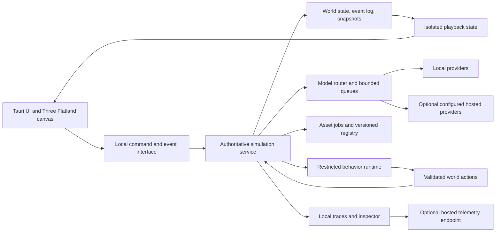

# Architecture recommendation and probes

> **2026-09-28:** this is the original proposal, kept for history. Accepted architecture lives in the [ADRs](../decisions/README.md), and later ADRs supersede parts of this document: [ADR-0003](../decisions/0003-simulation-service.md) (Bun sidecar supervised by the Tauri shell), [ADR-0005](../decisions/0005-model-providers.md) (model providers and scheduling; the heavy-work memory policy is open), [ADR-0008](../decisions/0008-world-state-and-client-transport.md) (event-log state model, durable proposal journal, new-slot import/restore, one-frame client transport). Milestone outcomes are in the [roadmap](mvp-roadmap.md).

Status: Recommendation for the implementing agent, not a completed implementation or benchmark.
The owner selected the desktop/rendering stack and delegated backend research.
Use the first milestone to confirm or revise this recommendation with measured evidence.

## Recommended shape

Use a separate local simulation service, a Tauri shell, and a reusable client.
The service owns world state, inference scheduling, generated execution, persistence, and trace collection.
The renderer consumes committed state/events and never decides authoritative outcomes.

A Bun TypeScript service with SQLite is the first backend candidate.
Bun documents standalone executables and a built-in SQLite API.
Tauri documents bundling external binaries, making a packaged service a plausible integration path.
This combination still needs packaging and background-lifecycle tests. [Bun executables](https://bun.sh/docs/bundler/executables), [Bun SQLite](https://bun.sh/docs/runtime/sqlite), [Tauri binaries](https://v2.tauri.app/develop/sidecar/).

Keeping the service independent also prepares for later hosted worlds.
It does not implement multiplayer in the MVP.
A window-owned child process alone does not prove that simulation survives window closure or application exit.



## Backend comparison

| Candidate | Reason to test | Main cost or question |
| --- | --- | --- |
| Bun/TypeScript service with SQLite | Shared types and Bun workspace; local packaging and database support | Background lifecycle, native dependencies, sandbox binding, per-platform packaging |
| Rust service with SQLite | Fits Tauri's native layer and a tightly controlled runtime | More cross-language contracts and model integration work |
| Python inference helper beside either service | Accommodates a selected local image/model runtime | Extra installation, process lifecycle, packaging, and memory cost |

Prefer one authoritative service and a small number of helpers.
Do not add a cloud database merely because a reference project uses one.
Keep optional model runtimes replaceable through adapters.

## Proposed workspace

These are planned boundaries, not folders already containing application code.

```text
apps/
  desktop/          Tauri shell, native integration, packaging
  client/           Shared views, input, Three Flatland renderer
  simulation/       Local service entry point and lifecycle
packages/
  contracts/        Versioned commands, events, content, save schemas
  world/            Rules, actions, time, economy, conflict, perception
  agents/           Context, memory, planning, model routing, fallback
  behaviors/        Generated-runtime host and validation
  persistence/      Transactions, snapshots, migrations, replay
  content/          Pack loading, lore manifests, realm definitions
  assets/           Generation adapters, provenance, asset registry
  telemetry/        Correlation, local inspection, export adapters
tools/
  content/          Validation and content import tools
  probes/           Hardware, provider, renderer, sandbox probes
  scenarios/        Acceptance fixtures and manual comparison tools
content/
  greek/            Authored characters, maps, abilities, lore sources
docs/
  decisions/        Architecture choices made during implementation
  solutions/        Engineering lessons for Systematic workflows
```

Use Bun for installation and workspace commands.
Rust or model-specific tools can still be required.
Do not force Bun to replace Tauri's build chain or a provider's inference runtime.

## State and event contracts

Use stable IDs for world, branch, character, realm, map, object, action, behavior, asset, and event.
Version schemas and content independently.
Persist action outcomes atomically with their authoritative events.

Keep raw model requests/responses in diagnostics according to retention settings.
Keep required action outcomes and presentation references in the world event log.
A save is not valid if its generated behavior or asset references cannot be resolved.

Handle commands idempotently so retries do not duplicate purchases, strikes, or scheduled disasters.
Local transport needs authentication or a private IPC boundary.
A future hosted server can implement the same domain commands with different user authorization.

## Rendering compatibility

Tauri uses platform webviews, so browser support alone is insufficient evidence.
Test canvas creation, shader compilation, sprite batching, input, and effects inside packaged applications.
Tauri's platform behavior is documented in [its webview reference](https://v2.tauri.app/reference/webview-versions/).

Follow the current [Three Flatland integration guidance](https://tjw.dev/three-flatland/llm-prompts/).
Pin matching versions and resolve its current machine-readable reference.
Test isometric sorting, sprite animation, lighting, hit testing, scaling, and a lightning/fire scene.

If an OS lacks the selected renderer, report a platform limitation with evidence.
Do not silently substitute Electron or a different renderer.
An explicit change to the selected stack requires an updated decision.

## Behavior execution

Prefer a small typed behavior language or isolated Lua over exposing the service's JavaScript runtime.
Lua provides host integration and standard libraries, but the host must decide what is exposed.
Instruction, memory, and capability limits require engineering beyond selecting a language. [Lua manual](https://www.lua.org/manual/5.4/manual.html).

Expose explicit world APIs through validated commands.
Use an allowlist of effects and permissions, stable inputs, and deterministic random sources where possible.
Run trials, enforce budgets, and terminate failed execution without affecting the host process.

Prove that the runtime cannot call filesystem, process, network, module-loading, debug escape, or unrestricted host functions.
Generated behavior cannot change its own admission rules.
Persist the exact admitted definition and resolved outcomes for later inspection.

## Probe deliverables

| Probe | Required report | Decision it enables |
| --- | --- | --- |
| Renderer | OS, webview, GPU, versions, screenshots, frame timings, input results | Supported platform list and renderer setup |
| Baseline inference | Model identifier, quantization, context, memory, queue wait, first/full response latency | Default models, active reasoning budget, population profile |
| Local art | Model/runtime, memory, duration, cancellation, coexistence with gameplay | Generation profile and scheduling |
| Backend lifecycle | Start, close window, stop, restart, crash, sleep/resume, duplicate-start behavior | Service packaging and persistence choice |
| Sandbox | Escape attempts, instruction/memory limits, partial-failure tests | Runtime and admission contract |
| Provider | Authentication mode, structured-action support, streaming, fallback, errors | Supported adapter matrix |
| Telemetry | Local/offline recording, endpoint export, redaction, retention, outage behavior | Export format and endpoint integration |
| Save/replay | Migration, corruption, versioned assets, restore, no-inference playback | Save format and event fidelity |

Requested provider names are integration targets, not evidence that retail OAuth works in a third-party app.
Research each supported connection against current official documentation.
Start with a supported API-key or local endpoint path where available; never reuse unrelated application session credentials.

## Resource priority

Prioritize input and rendering, committed simulation steps, direct conversation, scheduled reasoning, and finally optional artwork.
Keep queues bounded and cancel obsolete work.
Image generation can wait minutes and use coherent procedural art in the meantime.

Probe memory with the entire stack running, including the operating system and local inference.
One successful model request alone does not establish a playable profile.
Do not require a full local Langfuse deployment to pass the baseline.
