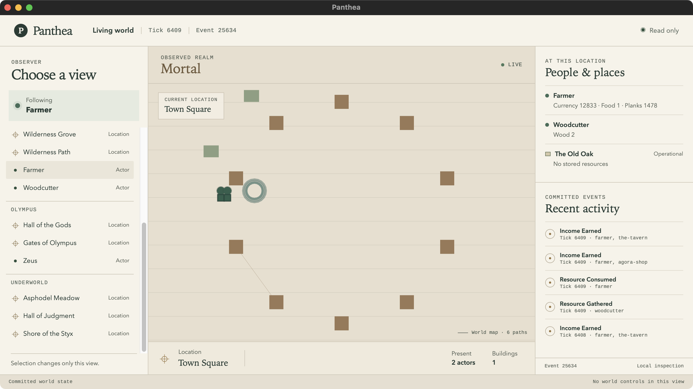
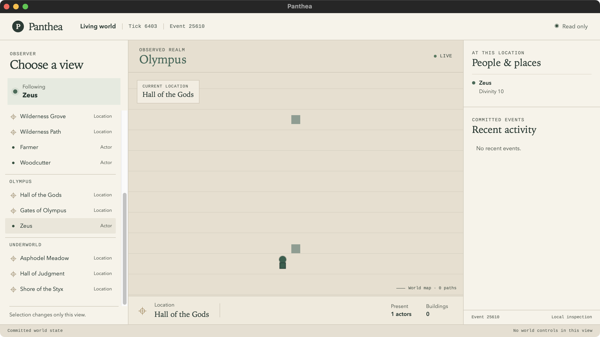
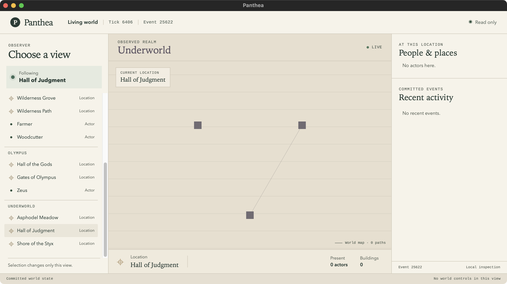

# m1-packaged-shell — packaged desktop smoke test

## Question

Does the packaged `panthea-desktop.app` build, launch, keep ticking offscreen
and in the background, and survive every tray-driven lifecycle transition
(pause, resume, window close, stop, restart, a killed sidecar, and quit)?

## Method

```sh
bun run --cwd apps/desktop tauri build
open apps/desktop/src-tauri/target/release/bundle/macos/panthea-desktop.app
```

The `.app` is launched directly with `open`, never `bun tauri dev`. Process
identity and the parent/child relationship come from `ps -eo pid,ppid,comm`.
World state is read **read-only**, never written, straight from the
persisted store:

```sh
sqlite3 -readonly <appDataDir>/active/world.sqlite 'select tick from clock'
```

`<appDataDir>` is `~/Library/Application Support/ai.panthe.desktop/`
(`tauri.conf.json`'s `identifier`). Ticks are sampled before and after each
transition to confirm advance, pin, or continuity.

**Tray automation note:** an AppleScript `click` on the tray's `menu bar
item` (to open the menu) was unreliable — intermittent `menuCount=0` /
"Invalid index -1719" even though the AX tree was readable once the menu was
actually open. Opening it by physically clicking the icon's screen
coordinates worked every time:

```sh
cliclick c:<icon-x>,<icon-y>
```

With the menu open that way, AppleScript drives the rest reliably:

```applescript
tell application "System Events" to tell process "panthea-desktop"
    click menu item "Pause" of menu 1 of menu bar item 1 of menu bar 2
end tell
```

Checked/unchecked state is read via `AXMenuItemMarkChar` on each menu item,
not by screen color-matching.

## Environment

| Field | Value |
| --- | --- |
| Hardware | MacBookPro18,3 (Apple Silicon, arm64) |
| Memory | 16 GB |
| OS | macOS 15.7.9 (24G830) |
| Date | 2026-09-28 |
| Commit | f395fe8 (main) |
| Bun | 1.4.2 |
| Tauri | 2.12.0 |

**Build:** `bun run --cwd apps/desktop tauri build` — 79.997s (client build
465ms, sidecar compile 181ms, `cargo build --release` 54.44s, remainder
bundling). `panthea-desktop.app`: 73.33 MiB. `.dmg` also built (28.68 MiB,
not required by this fixture).

## Results

| # | Check | Result | Key evidence |
| --- | --- | --- | --- |
| 1 | Build produces `.app` | **PASS** | 73.33 MiB, 79.997s, `.dmg` also built |
| 2 | Exactly one `panthea-sim`, child of the app | **PASS** | `ps`: desktop pid 1101 → sim pid 1106 |
| 3 | App data dir has world store + `lifecycle.lock` | **PASS** | `active/world.sqlite{,-shm,-wal}`, `lifecycle.lock`, `lifecycle.lock-journal` created |
| 4 | World ticking (read-only SQLite) | **PASS** | `clock.tick` 6 → 11 over 5s (1 Hz) |
| 5 | Tray menu readable via AX | **PASS** | full menu dumped via `AXMenuItemMarkChar` |
| 6 | Pause | **PASS** | tick pinned 257/257/257 over 6s, `paused=1`, tray: Paused ✓, Resume enabled |
| 7 | Resume | **PASS** | tick 257 → 260 in 3s, `paused=0`, tray: Running ✓ |
| 8 | Close main window → Background | **PASS** | window count 0, sim still alive (pid 1106), tick 277 → 280, tray: Background ✓ |
| 9 | Stop Background | **PASS** | sim process gone, window shown, tray: Stopped ✓, item relabeled "Restart Simulation" |
| 10 | No respawn 10s after Stop | **PASS** | no `panthea-sim` process after 10s wait |
| 11 | Restart Simulation | **PASS** | new sim pid 2846, tray: Running ✓, tick continued from persisted 287 (caught up to 322, then 322 → 325) — not reset |
| 12 | `kill -9` sidecar → supervisor respawn | **PASS** | respawn delay **0.62s**, tick continued 341 → 344, no reset |
| 13 | Quit | **PASS** | both processes exited in **1s**, zero orphans |
| 14 | Relaunch resumes from persisted tick | **PASS** | tick 358 on launch (caught up from persisted 349) → 358 → 361, continuous |

Full tray menu (Running state):

```
✓ Running (disabled)      Paused (disabled)      Background (disabled)
Stopped (disabled)        Unavailable (disabled)
———
Show (enabled)   Pause (enabled)   Resume (disabled)   Stop Background (enabled)
———
Quit (enabled)
```

## Known dev-machine hazard

The M0 `backend-lifecycle` probe (`tools/probes/backend-lifecycle/`) shares
this machine's `ai.panthe.desktop` app data dir and writes its own JSON
`lifecycle.lock`. The product's lock (`apps/simulation/src/lifecycle.ts`,
SQLite `PRAGMA locking_mode = EXCLUSIVE`) cannot open that file
(`SQLITE_NOTADB`) — the sidecar crashes on every launch attempt until the
stale file is removed. After running the probe, delete
`<appDataDir>/lifecycle.lock` before launching the packaged app.

## Not covered

- The client view — a placeholder when the shell smoke ran; covered by the
  View gate below.
- A real OS sleep/wake cycle (`pmset sleepnow` / lid close).
- Code signing and notarization.

## View gate

Does the packaged `.app` show live state through the read-only client view,
switch the observer across all three realms, keep drawing, and record
presentation receipts?

**Build:** `bun run --cwd apps/desktop tauri build` at 20ddd58 (release),
45 s, `panthea-desktop.app` 73.59 MiB, macOS 15.7.9 arm64, 2026-09-28.

**Method additions** (same launch, store reads, and tray driving as above):

- The picker is driven with `cliclick c:<x>,<y>` at element coordinates
  (window origin + screenshot pixel × 1.25); AppleScript clicks don't reach
  the WKWebView. The picker rail scrolls internally, so a scroll-wheel event
  over it brings Olympus and Underworld into reach.
- The view's text (header, realm heading, banners, scene errors) is read
  from the window's accessibility text via System Events, not OCR.
- Receipts are read read-only from `trace_receipts` (defined in
  `packages/telemetry/src/trace.ts`), joined to `events` for the kind:

  ```sh
  sqlite3 -readonly <appDataDir>/active/world.sqlite \
    "select count(*), datetime(min(presented_at_ms)/1000,'unixepoch','localtime'),
            datetime(max(presented_at_ms)/1000,'unixepoch','localtime'), max(e.sequence)
     from trace_receipts r join events e on e.id=r.event_id
     where r.session_id like 'session-<id>%'"
  ```

- Device loss is triggered on a debug build (`tauri build --debug`): right-click
  → Inspect Element opens a docked Web Inspector; in its console,
  `$1.getContext('webgl2').getExtension('WEBGL_lose_context').loseContext()`
  on the scene canvas.
- Screenshots are `screencapture -l <windowid>` only.

### Results

One release session, timed from launch; realm switches from t≥60 s, then
Mortal for the rest of the session (~6.5 min total, quit from the tray).

| # | Check | Result | Key evidence |
| --- | --- | --- | --- |
| 1 | No scene freeze | **PASS** | "Scene unavailable" count 0 in the accessibility text at t=32 s, 92 s, and 177 s; scene still drawing at t=200 s |
| 2 | Late realm switches redraw | **PASS** | Zeus → Hall of Judgment → Farmer → Zeus from t≈62 s: Olympus shows Zeus and its own map, the Underworld its own map, Mortal the full map; no mortal sprite outside Mortal |
| 3 | Receipts across the session | **PASS** | 143 receipts over 6 min 27 s (16:16:45–16:23:12), all `resource-traded`, up to the last traded event (sequence 26871). 152 traded events in the session; every one viewed in Mortal is receipted. The 9 without: 2 during startup catch-up, before the first frame, and 7 while viewing Olympus/Underworld |
| 4 | Device-loss recovery (debug build) | **PASS** | Console logged `WebGL Device Lost`, then a new renderer was built; the scene drew again, Olympus/Mortal switches redrew, receipts kept arriving (63 in that session) |
| 5a | Catch-up panel | **PASS** | Launch after a ~6 min gap: "Caught up: 7m applied, 0s skipped", visible at t≈5 s and t≈16 s, closed by ×, absent from every later frame (~180 s). Reappeared on each relaunch after a real gap |
| 5b | No page scroll | **PASS** | Wheel events over the scene leave header and footer fixed; no page scrollbar |
| 5c | Pause / resume | **PASS** | Tick pinned at 6657 with `paused=1`, "World paused" banner, tray Paused ✓; after Resume ticks advance and the banner clears |
| 5d | Header | **PASS** | "Tick N ▏Event M"; tick advances about once per second, event count about four per second |

Late switches deliver receipts in a batch: events still inside the frame's
recent-event window are drawn and receipted when the observer returns to
Mortal (16:17:51 and 16:18:22 in this run); older ones are not.

### CSP

The debug build's Web Inspector showed no errors and no CSP violations
(`script-src 'self' 'unsafe-eval'`). The only warning was the expected
`THREE.WebGPURenderer: WebGPU is not available, running under WebGL2
backend.` This was read on the 927ebd7 build. At 20ddd58 the debug console was
glanced at once, ~15 s after launch, and showed the same single warning
before the deliberate device loss; it was not read over a full session. The
release webview has no inspector (its context menu offers only Reload), so
its console was not read; a rendering, updating view is the release-side
evidence.

### Screenshots







Each is window-cropped: only the Panthea window.

### Not covered (view gate)

- A real OS sleep/wake cycle.
- Strike, fire, destroy, and worship receipts: none occurred in this world.
  The headless causal scenario covers them.
- The release-build console.
- Code signing and notarization.
